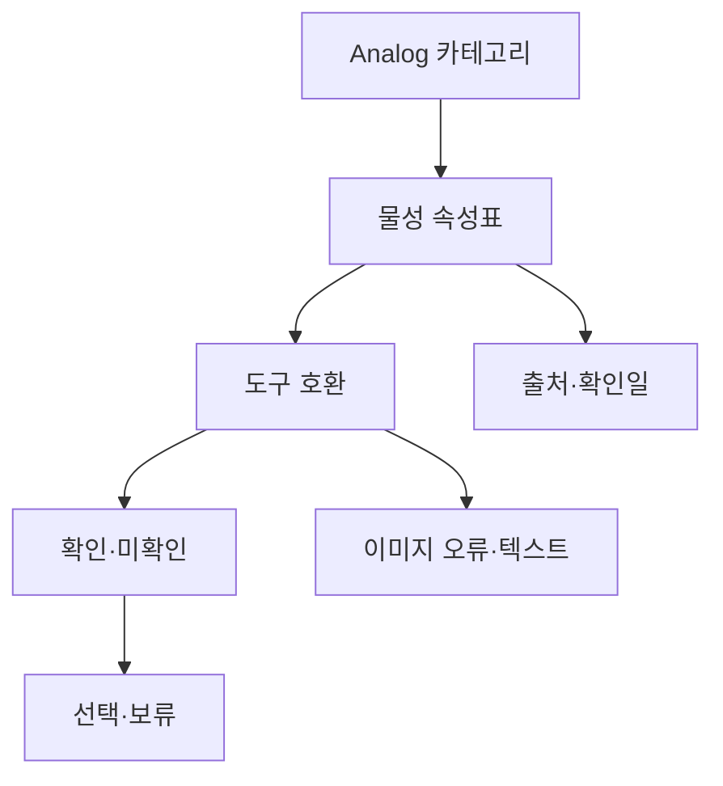

# VC-17 채운 — 사이트구조맵 A안 V3 상세본

## 1. Client·REQ 추적
- Client: VC-17 채운 / 아날로그 정보 부족
- 요구: 확인 물성·도구 호환·미확인 값을 같은 비교 구조로 제공
- 수용: 최소 두 개 확인 속성과 미확인 속성을 구분한다.
- 실패: 이미지로 무게·촉감·번짐을 추정한다.
- 추적: REQ-017, `CR-017`, SR-004·005, ER-016, PAGE-007·008·021
- 제품: PROD-001·003·033·063

### 제품 ID·제품군 배치
- PROD-001 — 여백 장문 모듈 노트: 분량·물성 비교
- PROD-003 — 물성 확인 기록 샘플러: 확인값·미확인값
- PROD-033 — 도구 호환 테스트 카드: 펜·번짐 확인
- PROD-063 — 종이 구조 비교 카드: 줄·여백·도구 호환

## 2. 구조 전략
`속성 비교형` — 치수·무게·용지·도구 호환을 확인 상태와 함께 비교하고 미확인 셀은 보류로 표시한다.

## 3. 페이지·콘텐츠·기능 계약
| PAGE | 목적 | 콘텐츠 | 기능·상태 |
|---|---|---|---|
| PAGE-007 | 재료·물성 | 용지·치수·무게·확인일 | 필터·비교 |
| PAGE-008 | 도구 호환 | 펜·번짐·미확인 | 상세·보류 |
| PAGE-021 | 후보 전체 | 속성표·출처 | 비교함·복귀 |

## 4. 사용자 흐름·상태
- 정상: Analog 카테고리 → 속성 비교 → 확인·미확인 구분 → 선택·보류
- 분기: 무게·촉감 미확인 → 이미지 추정 금지·보류; 도구 정보 없음 → 확인 필요
- 오류: 이미지 실패 시 텍스트 속성표 유지
- 상태: `DEFAULT / EMPTY / ERROR / OFFLINE / RESUME / HOLD`

## 5. 중복·끊김·가정 검증
- 제품명·감성 사진을 물성 근거로 사용하지 않는다.
- 각 속성에 상태·출처·확인일을 표시한다.
- 가격·내구 연수·재고·배송은 확정하지 않는다.
- 키보드·대체 텍스트·320px·200% 확대를 검증한다.

## 6. Mermaid

## 7. 판정
`KEEP / 후보 A` — 확인 속성과 미확인 속성을 가장 직접적으로 비교한다.
