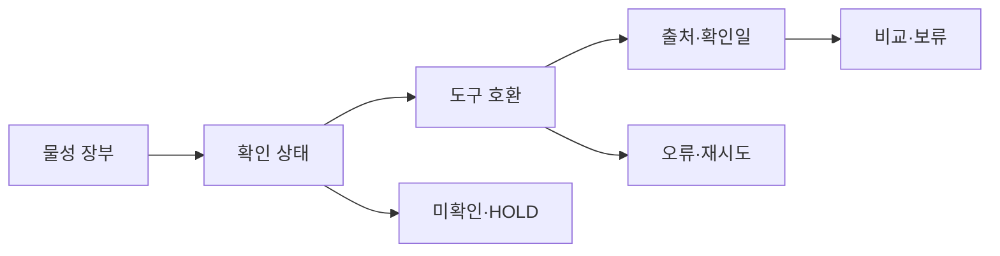

# VC-17 채운 — 사이트구조맵 B안 V3 상세본

## 1. Client·REQ 추적
- Client: VC-17 채운 / 아날로그 정보 부족
- 요구·추적: REQ-017, `CR-017`, SR-004·005, ER-016, PAGE-007·008·021
- 수용: 두 개 이상의 확인 속성과 미확인 속성을 구분
- 차단: 이미지로 무게·촉감·번짐을 확정
- 제품: PROD-001·003·033·063

### 제품 ID·제품군 배치
- PROD-001 — 여백 장문 모듈 노트: 장문·분량
- PROD-003 — 물성 확인 기록 샘플러: 출처·확인일
- PROD-033 — 도구 호환 테스트 카드: 호환·번짐
- PROD-063 — 종이 구조 비교 카드: 용지 구조

## 2. 구조 전략
`물성 검증 장부형` — 제품마다 물성 주장·확인값·미확인값·출처·확인일을 장부로 관리한다.

## 3. 페이지·콘텐츠·기능 계약
| PAGE | 목적 | 콘텐츠 | 기능·상태 |
|---|---|---|---|
| PAGE-007 | 장부 진입 | 재료·물성 | 상태 필터 |
| PAGE-008 | 호환 판단 | 도구·번짐·미정 | 비교·보류 |
| PAGE-021 | 전체 비교 | 후보·출처 | 조건 완화·복귀 |

## 4. 사용자 흐름·상태
- 정상: 장부 → 속성 상태 필터 → 후보 비교 → 출처·한계 확인
- 분기: 출처 시점 경과 → 최신성 경고; 미확인 필드 → 보류
- 오류·Offline: 마지막 확인일과 실패 필드를 표시하고 재시도
- 상태: `DEFAULT / EMPTY / ERROR / OFFLINE / RESUME / HOLD`

## 5. 중복·끊김·가정 검증
- 주장과 확인값을 같은 문장으로 합치지 않는다.
- 촉감·무게·번짐은 직접 확인 전 미정으로 유지한다.
- 장부와 상세는 ID·출처로 연결한다.
- Heading·Label·키보드·스크린리더·reduced motion을 검증한다.

## 6. Mermaid

## 7. 판정
`KEEP / 후보 B` — 근거의 시점과 상태 추적에 강하다.
