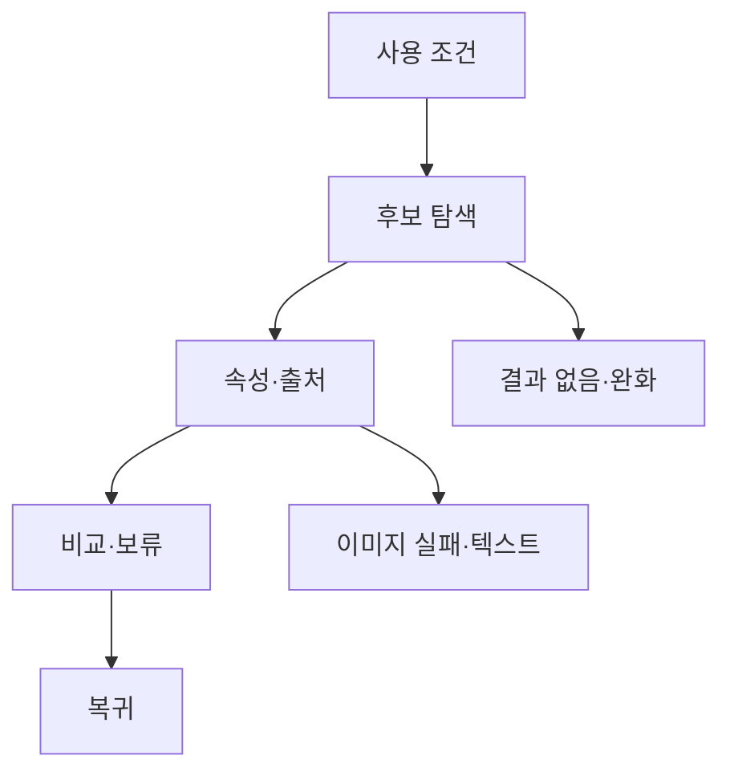

# VC-17 채운 — 사이트구조맵 C안 V3 상세본

## 1. Client·REQ 추적
- Client: VC-17 채운 / 아날로그 정보 부족
- 요구·추적: REQ-017, `CR-017`, PAGE-007·008·021
- 성공: 확인된 속성만으로 선택하고 미확인 항목은 보류
- 실패: 감성 이미지로 물성을 추정
- 제품: PROD-001·003·033·063

### 제품 ID·제품군 배치
- PROD-001 — 여백 장문 모듈 노트: 사용 조건 후보
- PROD-003 — 물성 확인 기록 샘플러: 확인·보류
- PROD-033 — 도구 호환 테스트 카드: 도구별 판단
- PROD-063 — 종이 구조 비교 카드: 구조·치수

## 2. 구조 전략
`사용 조건 역검증형` — 사용 도구와 휴대 조건을 먼저 고른 뒤 제품 상세에서 물성 근거를 확인한다.

## 3. 페이지·콘텐츠·기능 계약
| PAGE | 목적 | 콘텐츠 | 기능·상태 |
|---|---|---|---|
| PAGE-007 | 조건 선택 | 도구·휴대·분량 | 단계형 필터 |
| PAGE-008 | 제품 상세 | 속성·출처·미정 | 비교·보류 |
| PAGE-021 | 후보 탐색 | 물성 카드 | 전체 보기·복귀 |

## 4. 사용자 흐름·상태
- 정상: 사용 조건 → 후보 → 속성 확인 → 비교·보류
- 분기: 조건에 맞는 근거 없음 → 결과 없음·조건 완화
- 오류: 이미지·파일 실패 시 텍스트 속성·재시도 제공
- 상태: `DEFAULT / EMPTY / ERROR / OFFLINE / RESUME / HOLD`

## 5. 중복·끊김·가정 검증
- 사용 조건이 물성 사실을 대신하지 않도록 구분한다.
- 미확인 속성은 선택 근거로 사용하지 않는다.
- 제품은 가상 후보이며 가격·인증·내구 연수를 확정하지 않는다.
- 모바일 레일·키보드·대체 조작을 제공한다.

## 6. Mermaid

## 7. 판정
`KEEP / 후보 C` — 사용 맥락을 먼저 제시해 비교 부담을 낮춘다.
