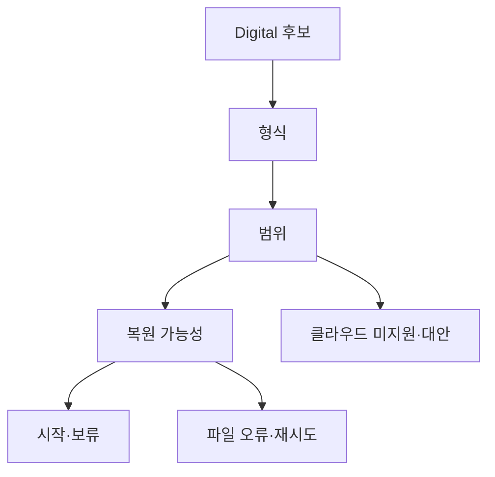

# VC-18 서우 — 사이트구조맵 A안 V3 상세본

## 1. Client·REQ 추적
- Client: VC-18 서우 / 디지털 내보내기 판단
- 요구: 내보내기 형식·범위·복원 가능성 분리, 미지원 대안 제시
- 수용: 세 기능을 혼동하지 않고 시작 또는 보류 이유를 설명
- 실패: 클라우드·내보내기·복원을 동일 기능처럼 표현
- 추적: REQ-018, `CR-018`, SR-019, ER-010·011, PAGE-012·019·021
- 제품: PROD-014·044·078·079

### 제품 ID·제품군 배치
- PROD-014 — Analog·Digital 브리지 폴더: 수동 연결·미지원
- PROD-044 — 내보내기 범위 확인표: 형식·범위
- PROD-078 — 수동 백업 판단 카드: 백업·복원 구분
- PROD-079 — 기록 방식 전환 노트: 매체 역할·수동 단계

## 2. 구조 전략
`정책 분리형` — 형식·범위·복원·클라우드 상태를 별도 카드와 미지원 대안으로 확인한다.

## 3. 페이지·콘텐츠·기능 계약
| PAGE | 목적 | 콘텐츠 | 기능·상태 |
|---|---|---|---|
| PAGE-012 | 정책 확인 | 형식·범위·복원 | 상태 보기·보류 |
| PAGE-019 | 상태·복귀 | 미지원·현재 범위 | Resume·초기화 |
| PAGE-021 | 후보 비교 | Digital 후보·정책 | 비교·복귀 |

## 4. 사용자 흐름·상태
- 정상: Digital 후보 → 형식 확인 → 범위 확인 → 복원 가능성 → 시작·보류
- 분기: 클라우드 미지원 → 로컬·수동 대안; 복원 불명 → 보류
- 오류: 파일 생성 실패 → 재시도·미지원 안내
- 상태: `DEFAULT / EMPTY / ERROR / OFFLINE / RESUME / HOLD`

## 5. 중복·끊김·가정 검증
- 백업·내보내기·복원·클라우드를 별도 용어로 표시한다.
- 자동 동기화·완전 복원을 확정하지 않는다.
- 형식·범위·확인일·제한을 카드에 고정한다.
- 키보드·Label·상태 텍스트·320px·200% 확대를 검증한다.

## 6. Mermaid

## 7. 판정
`KEEP / 후보 A` — 세 기능을 가장 명확히 분리한다.
