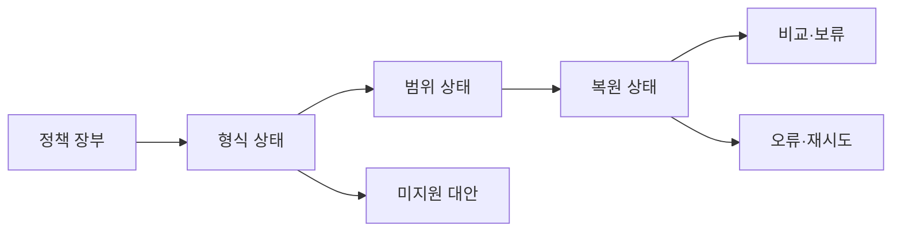

# VC-18 서우 — 사이트구조맵 B안 V3 상세본

## 1. Client·REQ 추적
- Client: VC-18 서우 / 디지털 내보내기 판단
- 요구·추적: REQ-018, `CR-018`, SR-019, ER-010·011, PAGE-012·019·021
- 수용: 형식·범위·복원 차이를 알고 보류
- 차단: 클라우드와 내보내기를 같은 기능으로 표시
- 제품: PROD-014·044·078·079

### 제품 ID·제품군 배치
- PROD-014 — Analog·Digital 브리지 폴더: 원본·수동 연결
- PROD-044 — 내보내기 범위 확인표: 데이터 범위·확인일
- PROD-078 — 수동 백업 판단 카드: 형식·미지원
- PROD-079 — 기록 방식 전환 노트: 전환 단계·역할

## 2. 구조 전략
`데이터 정책 장부형` — 각 기능의 지원·미지원·미정을 장부로 비교한다.

## 3. 페이지·콘텐츠·기능 계약
| PAGE | 목적 | 콘텐츠 | 기능·상태 |
|---|---|---|---|
| PAGE-012 | 장부 진입 | 데이터 정책·범위 | 필터·상세 |
| PAGE-019 | 보존·복귀 | 미지원·확인일 | Resume·HOLD |
| PAGE-021 | 제품 비교 | 형식·복원 차이 | 비교·보류 |

## 4. 사용자 흐름·상태
- 정상: 정책 장부 → 기능별 상태 → 후보 비교 → 선택·보류
- 분기: 미지원 필드 → 대체 방식·수동 안내; 범위 불명 → 시작 차단
- 오류·Offline: 마지막 확인일·변경 가능성을 표시한다.
- 상태: `DEFAULT / EMPTY / ERROR / OFFLINE / RESUME / HOLD`

## 5. 중복·끊김·가정 검증
- 장부와 상세는 동일 ID·용어로 연결한다.
- 계정·클라우드·복원은 근거 없으면 `HOLD`다.
- 삭제·백업과 내보내기를 혼동하지 않는다.
- 스크린리더 Heading·키보드·상태 텍스트를 제공한다.

## 6. Mermaid

## 7. 판정
`KEEP / 후보 B` — 지원 여부와 제한 추적에 강하다.
