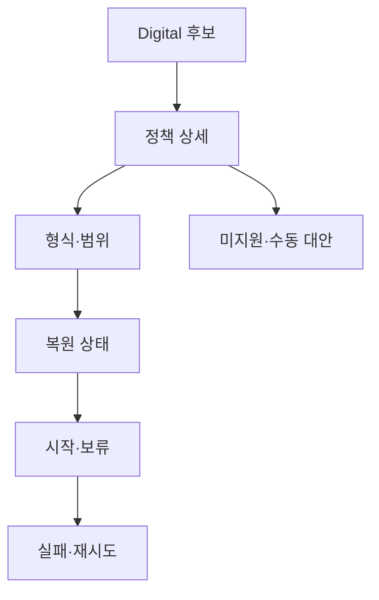

# VC-18 서우 — 사이트구조맵 C안 V3 상세본

## 1. Client·REQ 추적
- Client: VC-18 서우 / 디지털 내보내기 판단
- 요구·추적: REQ-018, `CR-018`, PAGE-012·019·021
- 성공: 지원 여부와 미지원 대안을 알고 선택·보류
- 실패: 클라우드·내보내기·복원을 동일시
- 제품: PROD-014·044·078·079

### 제품 ID·제품군 배치
- PROD-014 — Analog·Digital 브리지 폴더: 수동 대안
- PROD-044 — 내보내기 범위 확인표: 선택 범위
- PROD-078 — 수동 백업 판단 카드: 복원 가능성
- PROD-079 — 기록 방식 전환 노트: 매체 전환

## 2. 구조 전략
`후보 선택 후 정책 확인형` — Digital 후보를 먼저 비교하되 상세에서 형식·범위·복원 상태를 확인한다.

## 3. 페이지·콘텐츠·기능 계약
| PAGE | 목적 | 콘텐츠 | 기능·상태 |
|---|---|---|---|
| PAGE-012 | 상세 정책 | 형식·범위·복원 | 확인·보류 |
| PAGE-019 | 복귀 | 미지원·현재 상태 | Resume·초기화 |
| PAGE-021 | 탐색 | 후보·비교 | 조건 수정·복귀 |

## 4. 사용자 흐름·상태
- 정상: 후보 → 정책 상세 → 지원 상태 확인 → 시작·보류
- 분기: 복원 미지원 → 수동 대안; 형식 미정 → 보류
- 오류: 내보내기 실패 → 파일 없이 상태만 유지·재시도
- 상태: `DEFAULT / EMPTY / ERROR / OFFLINE / RESUME / HOLD`

## 5. 중복·끊김·가정 검증
- 제품 이미지·마케팅 문구가 복원 보장을 대신하지 않는다.
- 지원 범위·형식·복원·확인일을 고정한다.
- 가격·클라우드·자동 복원은 미정이면 CTA를 차단한다.
- 모바일에서도 정책 정보를 가로 스크롤 없이 읽는다.

## 6. Mermaid

## 7. 판정
`KEEP / 후보 C` — 제품 탐색을 유지하면서 정책 확인을 연결한다.
