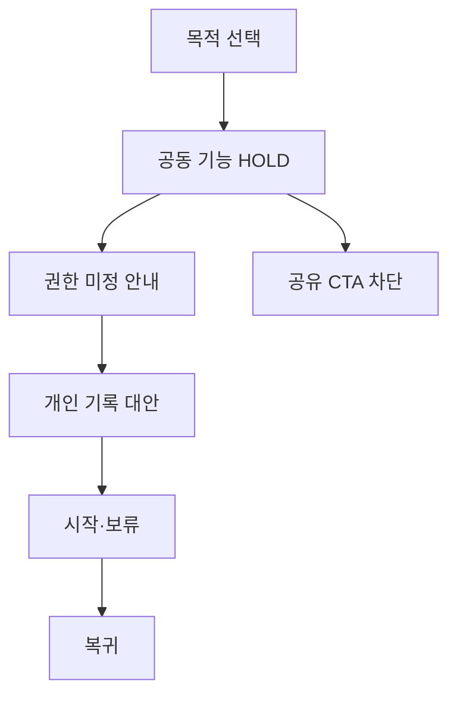

# VC-19 초아 — 사이트구조맵 A안 V3 상세본

## 1. Client·REQ 추적
- Client: VC-19 초아 / 가족 공동 기록 경계
- 판정: `HOLD / HYPOTHESIS`
- 요구: 공동 기능 HOLD, 권한 미정 표시, 개인 기록 대체 경로
- 수용: 미지원 기능을 실행 가능한 것으로 오해하지 않고 대안을 찾는다.
- 실패: 초대·공유 CTA 또는 타인 동의 추정
- 추적: REQ-019, `CR-019`, SR-019·020, ER-009·010, PAGE-001·019·021
- 제품: 직접 연결 제품 없음

## 2. 구조 전략
`공유 차단·개인 대안형` — 공동 기록은 HOLD 상태를 명확히 표시하고 개인 기록·수동 공유 안내로만 이동한다.

## 3. 페이지·콘텐츠·기능 계약
| PAGE | 목적 | 콘텐츠 | 기능·상태 |
|---|---|---|---|
| PAGE-001 | 진입 | 공동 기능 상태·개인 대안 | 안내·보류 |
| PAGE-019 | 권한·복귀 | 미지원·HOLD·개인 전환 | 초기화·복귀 |
| PAGE-021 | 탐색 | 개인 기록 후보·공유 주의 | 비교·보류 |

## 4. 사용자 흐름·상태
- 정상: 목적 선택 → 공동 기능 HOLD 확인 → 개인 기록 대안 → 시작·보류
- 분기: 권한 미정 → 공유 실행 차단·정책 안내
- 오류: 초대 링크·공유 기능 없음 → 오류가 아닌 미지원 상태로 표시
- 상태: `DEFAULT / EMPTY / ERROR / OFFLINE / RESUME / HOLD`

## 5. 중복·끊김·가정 검증
- 함께·공동·공유 문구를 기능 지원으로 해석하지 않는다.
- 타인 동의·초대·공개 범위를 추정하지 않는다.
- 가족용 제품·가격·공유 기능은 근거 없어 확정하지 않는다.
- 키보드·상태 텍스트·대체 개인 경로를 제공한다.

## 6. Mermaid

## 7. 판정
`HOLD / 후보 A` — 미지원 공동 기능과 개인 대안을 명확히 구분한다.
