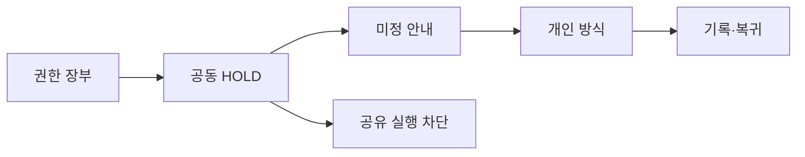

# VC-19 초아 — 사이트구조맵 B안 V3 상세본

## 1. Client·REQ 추적
- Client: VC-19 초아 / 가족 공동 기록 경계
- 요구·추적: REQ-019, `CR-019`, SR-019·020, ER-009·010, PAGE-001·019·021
- 수용: 미지원 상태를 알고 개인 대안을 선택
- 차단: 공유·초대 CTA, 타인 동의 추정
- 제품: 직접 연결 제품 없음

## 2. 구조 전략
`권한 상태 장부형` — 공동·개인·미정 권한을 장부로 분리하고 HOLD 기능은 실행 버튼 없이 설명만 제공한다.

## 3. 페이지·콘텐츠·기능 계약
| PAGE | 목적 | 콘텐츠 | 기능·상태 |
|---|---|---|---|
| PAGE-001 | 상태 진입 | 권한 요약·대안 | 개인 경로 |
| PAGE-019 | 장부 확인 | 지원·미지원·미정 | 보류·복귀 |
| PAGE-021 | 후보 탐색 | 개인 기록 방식 | 비교·초기화 |

## 4. 사용자 흐름·상태
- 정상: 권한 장부 → 공동 HOLD → 개인 방식 → 기록
- 분기: 미정 권한 → 실행 차단·확인 필요
- Empty·Error·Offline: 공유 후보 없음과 시스템 오류를 분리한다.
- 상태: `DEFAULT / EMPTY / ERROR / OFFLINE / RESUME / HOLD`

## 5. 중복·끊김·가정 검증
- 공동 기능은 제품·페이지 어디에서도 확정하지 않는다.
- 개인 대안과 공유 대안을 같은 CTA로 합치지 않는다.
- 초대·계정·동기화는 `HOLD`다.
- 현재 위치·취소·키보드 포커스를 보존한다.

## 6. Mermaid

## 7. 판정
`HOLD / 후보 B` — 권한 상태와 실행 차단을 추적하기 쉽다.
