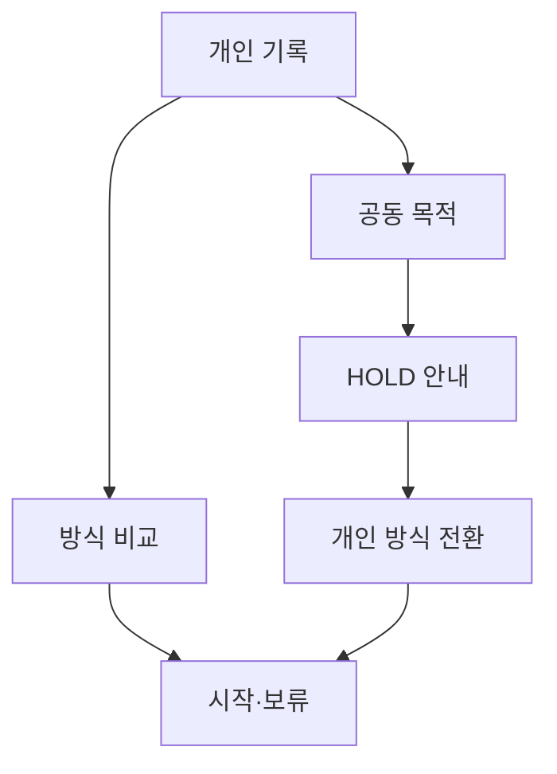

# VC-19 초아 — 사이트구조맵 C안 V3 상세본

## 1. Client·REQ 추적
- Client: VC-19 초아 / 가족 공동 기록 경계
- 요구·추적: REQ-019, `CR-019`, PAGE-001·019·021
- 성공: 공동 지원 여부를 오해하지 않고 개인 경로로 전환
- 실패: 감성 문구를 공유 기능으로 오인
- 제품: 직접 연결 제품 없음

## 2. 구조 전략
`개인 기록 우선형` — 공동 기록 진입을 제공하지 않고 개인 기록을 기본값으로 두며 공동 기능은 보류 안내에서만 설명한다.

## 3. 페이지·콘텐츠·기능 계약
| PAGE | 목적 | 콘텐츠 | 기능·상태 |
|---|---|---|---|
| PAGE-001 | 안전한 진입 | 개인 기록·공동 HOLD | 방식 선택 |
| PAGE-019 | 상태·복귀 | 미지원·권한 미정 | 보류·복귀 |
| PAGE-021 | 개인 탐색 | 기록 방식 후보 | 비교·초기화 |

## 4. 사용자 흐름·상태
- 정상: 개인 기록 선택 → 방식 비교 → 시작·보류
- 분기: 공동 목적 선택 → HOLD 안내 → 개인 방식 전환
- 오류: 공유 링크·초대 요청은 실행 불가 상태로 안내
- 상태: `DEFAULT / EMPTY / ERROR / OFFLINE / RESUME / HOLD`

## 5. 중복·끊김·가정 검증
- 개인 기록과 공동 기록의 용어·CTA를 분리한다.
- 타인 개인정보·동의·공개 범위를 추정하지 않는다.
- 회원·공유·초대·권한은 근거가 없어 `HOLD`다.
- 320px·200%·키보드에서도 HOLD와 대안이 보인다.

## 6. Mermaid

## 7. 판정
`HOLD / 후보 C` — 공동 기능을 오인할 가능성을 가장 낮춘다.
