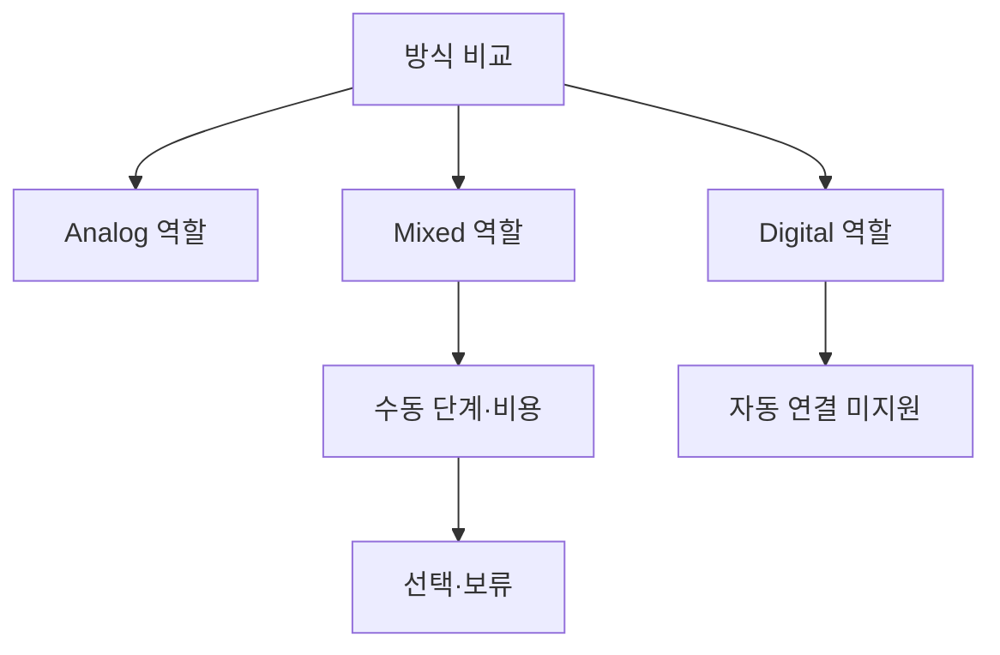

# VC-20 주원 — 사이트구조맵 A안 V3 상세본

## 1. Client·REQ 추적
- Client: VC-20 주원 / 기록 방식 전환
- 요구: 역할 분담·전환 비용·수동 단계·미지원 기능 명시
- 수용: 각 매체에 남는 것과 사용자 행동을 설명한다.
- 실패: 종이 내용을 자동 검색·동기화한다고 암시
- 추적: REQ-020, `CR-020`, SR-001·002·019, ER-009, PAGE-001·014·019·021
- 제품: PROD-006·014·043·079·090

### 제품 ID·제품군 배치
- PROD-006 — Analog·Digital 방식 비교 카드
- PROD-014 — Analog·Digital 브리지 폴더
- PROD-043 — 수동 전환 단계 카드
- PROD-079 — 기록 방식 전환 노트
- PROD-090 — 선물 매체 선택 카드

## 2. 구조 전략
`역할 분담 비교형` — Analog·Digital·Mixed의 역할과 수동 전환 단계를 나란히 보여준다.

## 3. 페이지·콘텐츠·기능 계약
| PAGE | 목적 | 콘텐츠 | 기능·상태 |
|---|---|---|---|
| PAGE-001 | 방식 진입 | Analog·Digital·Mixed 요약 | 비교·선택 |
| PAGE-014 | 전환 비교 | 역할·비용·준비물 | 비교·보류 |
| PAGE-019 | 상태 | 수동 단계·미지원 | Resume·HOLD |
| PAGE-021 | 후보 탐색 | 방식별 제품·콘텐츠 | 필터·복귀 |

## 4. 사용자 흐름·상태
- 정상: 방식 비교 → 역할 확인 → 수동 단계 확인 → Mixed 선택·보류
- 분기: 자동 연결 미지원 → 수동 대안; 준비물 부담 → Analog 또는 Digital 선택
- 오류: 전환 정보 실패 → 미지원 상태·재시도
- 상태: `DEFAULT / EMPTY / ERROR / OFFLINE / RESUME / HOLD`

## 5. 중복·끊김·가정 검증
- 자동 검색·동기화·완전 이전을 약속하지 않는다.
- 매체별 남는 정보·사용자 행동·전환 비용을 분리한다.
- 가격·배송·클라우드는 근거 없으면 `HOLD`다.
- 키보드·상태 텍스트·모바일 세로 흐름을 검증한다.

## 6. Mermaid

## 7. 판정
`KEEP / 후보 A` — 매체별 역할과 전환 비용을 직접 비교한다.
