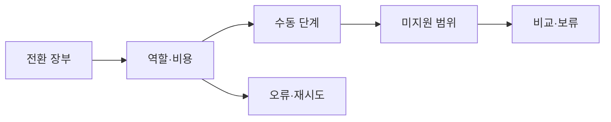

# VC-20 주원 — 사이트구조맵 B안 V3 상세본

## 1. Client·REQ 추적
- Client: VC-20 주원 / 기록 방식 전환
- 요구·추적: REQ-020, `CR-020`, SR-001·002·019, PAGE-001·014·019·021
- 수용: 역할·수동 단계·미지원 범위를 이해
- 차단: 종이와 디지털의 자동 동기화 암시
- 제품: PROD-006·014·043·079·090

### 제품 ID·제품군 배치
- PROD-006 — Analog·Digital 방식 비교 카드
- PROD-014 — Analog·Digital 브리지 폴더
- PROD-043 — 수동 전환 단계 카드
- PROD-079 — 기록 방식 전환 노트
- PROD-090 — 선물 매체 선택 카드

## 2. 구조 전략
`전환 장부형` — 전환 전·중·후에 무엇이 남고 무엇을 수동으로 해야 하는지 장부로 기록한다.

## 3. 페이지·콘텐츠·기능 계약
| PAGE | 목적 | 콘텐츠 | 기능·상태 |
|---|---|---|---|
| PAGE-001 | 장부 진입 | 방식·전환 요약 | 선택 |
| PAGE-014 | 장부 | 역할·비용·수동 | 필터·비교 |
| PAGE-019 | 복귀 | 진행 상태·미지원 | Resume·초기화 |
| PAGE-021 | 후보 | 방식·준비물 | 비교·보류 |

## 4. 사용자 흐름·상태
- 정상: 전환 장부 → 역할·비용 → 수동 단계 → 후보 비교
- 분기: 자동 기능 미지원 → 수동 기록·보류; 데이터 범위 불명 → 시작 차단
- 오류·Offline: 마지막 확인일·미지원 범위 표시
- 상태: `DEFAULT / EMPTY / ERROR / OFFLINE / RESUME / HOLD`

## 5. 중복·끊김·가정 검증
- 전환 장부와 제품 상세는 동일 용어·ID로 연결한다.
- 클라우드·백업·내보내기·복원을 한 기능으로 합치지 않는다.
- 계정·가격·동기화는 `HOLD`다.
- Heading·Label·키보드·대체 텍스트를 제공한다.

## 6. Mermaid

## 7. 판정
`KEEP / 후보 B` — 수동 전환과 미지원 범위의 추적성이 높다.
