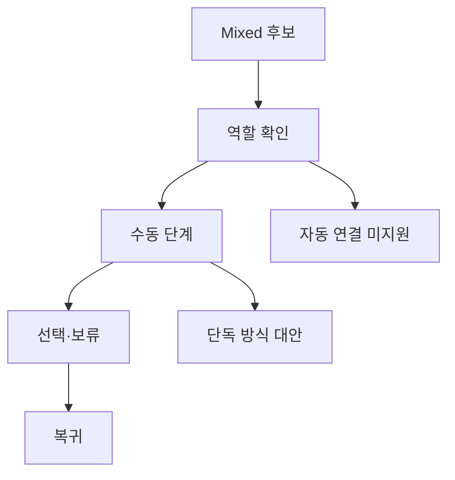

# VC-20 주원 — 사이트구조맵 C안 V3 상세본

## 1. Client·REQ 추적
- Client: VC-20 주원 / 기록 방식 전환
- 요구·추적: REQ-020, `CR-020`, PAGE-001·014·019·021
- 성공: 매체별 남는 정보와 수동 행동을 설명
- 실패: 자동 검색·동기화·완전 이전 암시
- 제품: PROD-006·014·043·079·090

### 제품 ID·제품군 배치
- PROD-006 — Analog·Digital 방식 비교 카드
- PROD-014 — Analog·Digital 브리지 폴더
- PROD-043 — 수동 전환 단계 카드
- PROD-079 — 기록 방식 전환 노트
- PROD-090 — 선물 매체 선택 카드

## 2. 구조 전략
`Mixed 선택 후 검증형` — Mixed 후보를 먼저 보여주되 상세에서 매체 역할과 수동 연결을 확인하게 한다.

## 3. 페이지·콘텐츠·기능 계약
| PAGE | 목적 | 콘텐츠 | 기능·상태 |
|---|---|---|---|
| PAGE-001 | 후보 진입 | 방식 비교 | 상세 이동 |
| PAGE-014 | Mixed 상세 | 역할·수동 단계 | 비교·보류 |
| PAGE-019 | 복귀 | 상태·미지원 | Resume·HOLD |
| PAGE-021 | 전체 탐색 | 준비물·비용 | 조건 수정 |

## 4. 사용자 흐름·상태
- 정상: Mixed 후보 → 역할 확인 → 수동 단계 → 선택·보류
- 분기: 수동 비용 과다 → Analog·Digital 단독 대안
- 오류: 연결 정보 실패 → 텍스트 정책·재시도
- 상태: `DEFAULT / EMPTY / ERROR / OFFLINE / RESUME / HOLD`

## 5. 중복·끊김·가정 검증
- Mixed를 자동 동기화로 표현하지 않는다.
- 사용자가 해야 할 행동·남는 정보·미지원 기능을 카드에 고정한다.
- 계정·클라우드·완전 이전은 `HOLD`다.
- 모바일에서도 역할 표를 가로 스크롤 없이 읽는다.

## 6. Mermaid

## 7. 판정
`KEEP / 후보 C` — Mixed의 장점과 전환 비용을 동시에 보여준다.
