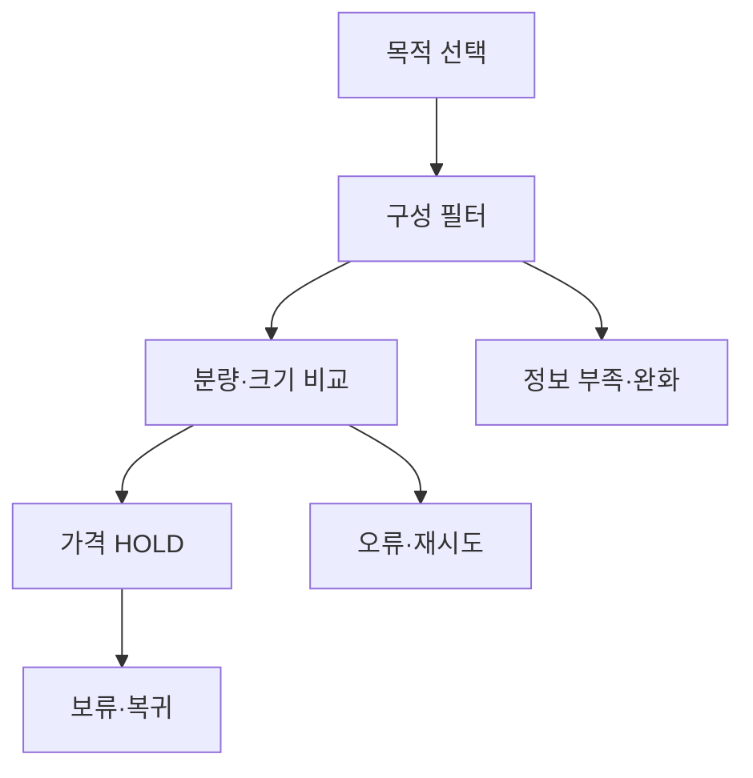

# VC-21 민서 — 사이트구조맵 A안 V3 상세본

## 1. Client·REQ 추적
- Client: VC-21 민서 / 예산 미정 탐색
- 판정: `HOLD / HYPOTHESIS`
- 요구: 가격 미정 표시, 구성 중심 비교, 구매 CTA 차단, 보류 이유 보존
- 수용: 가격 확정 전 판단 가능·불가능 내용을 구분한다.
- 실패: 가짜 가격·할인·순위·가성비 생성
- 추적: REQ-021, `CR-021`, SR-019, ER-007·009, PAGE-007·008·014·021
- 제품: PROD-032 휴대형 분량 조절 노트

### 제품 ID·제품군 배치
- PROD-032 — 휴대형 분량 조절 노트: 크기·분량·구성 비교

## 2. 구조 전략
`구성 우선형` — 가격을 표시하지 않고 분량·크기·준비물·사용 상황을 기준으로 후보를 비교한다.

## 3. 페이지·콘텐츠·기능 계약
| PAGE | 목적 | 콘텐츠 | 기능·상태 |
|---|---|---|---|
| PAGE-007 | 구성 탐색 | 크기·분량·준비물 | 필터·비교 |
| PAGE-008 | 후보 상세 | 구성·가격 미정 | 보류·근거 |
| PAGE-014 | 비교 | 구성 차이·한계 | 비교·초기화 |
| PAGE-021 | 전체 후보 | 제품군·HOLD | 구매 CTA 차단 |

## 4. 사용자 흐름·상태
- 정상: 목적 선택 → 구성 비교 → 가격 HOLD 확인 → 보류
- 분기: 구성 정보 부족 → 미정 표시·조건 완화
- 오류: 후보 로드 실패 → 재시도·보류 이유 보존
- 상태: `DEFAULT / EMPTY / ERROR / OFFLINE / RESUME / HOLD`

## 5. 중복·끊김·가정 검증
- 가격·할인·순위·가성비를 생성하지 않는다.
- `가격 미정`과 `구성 확인됨`을 별도 상태로 표시한다.
- 구매·결제·배송 CTA는 금지한다.
- 키보드·상태 텍스트·320px·200% 확대를 검증한다.

## 6. Mermaid

## 7. 판정
`HOLD / 후보 A` — 가격 없이 판단 가능한 정보에 집중한다.
