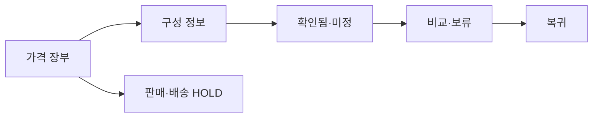

# VC-21 민서 — 사이트구조맵 B안 V3 상세본

## 1. Client·REQ 추적
- Client: VC-21 민서 / 예산 미정 탐색
- 요구·추적: REQ-021, `CR-021`, SR-019, ER-007·009, PAGE-007·008·014·021
- 수용: 가능 정보와 불가능 정보를 분리
- 차단: 가격·할인·순위·가성비 창작
- 제품: PROD-032 휴대형 분량 조절 노트

### 제품 ID·제품군 배치
- PROD-032 — 휴대형 분량 조절 노트: 가격 미정 상태의 구성 중심 후보

## 2. 구조 전략
`가격 상태 장부형` — 가격·판매·배송·재고 상태를 장부로 분리하고 구성 정보만 비교 가능하게 한다.

## 3. 페이지·콘텐츠·기능 계약
| PAGE | 목적 | 콘텐츠 | 기능·상태 |
|---|---|---|---|
| PAGE-007 | 장부 진입 | 가격·정책 상태 | 상태 필터 |
| PAGE-008 | 구성 상세 | 분량·크기·준비물 | 비교·보류 |
| PAGE-014 | 판단 | 확인됨·미정 | 근거 보기 |
| PAGE-021 | 후보 | 가상 제품 고지 | 구매 차단 |

## 4. 사용자 흐름·상태
- 정상: 가격 장부 → 구성 필터 → 후보 비교 → 보류 이유 저장
- 분기: 가격 미정 → 구매 CTA 없음·알림 약속 없음
- 오류·Offline: 마지막 확인일과 변경 위험 표시
- 상태: `DEFAULT / EMPTY / ERROR / OFFLINE / RESUME / HOLD`

## 5. 중복·끊김·가정 검증
- 가격 장부와 제품 카드를 같은 값으로 복제하지 않는다.
- 실제 판매·재고·배송은 `HOLD`다.
- 보류 이유를 유지하고 조건 초기화를 제공한다.
- 접근성 Label·Heading·키보드를 검증한다.

## 6. Mermaid

## 7. 판정
`HOLD / 후보 B` — 가격 정책과 구성 판단을 분리한다.
