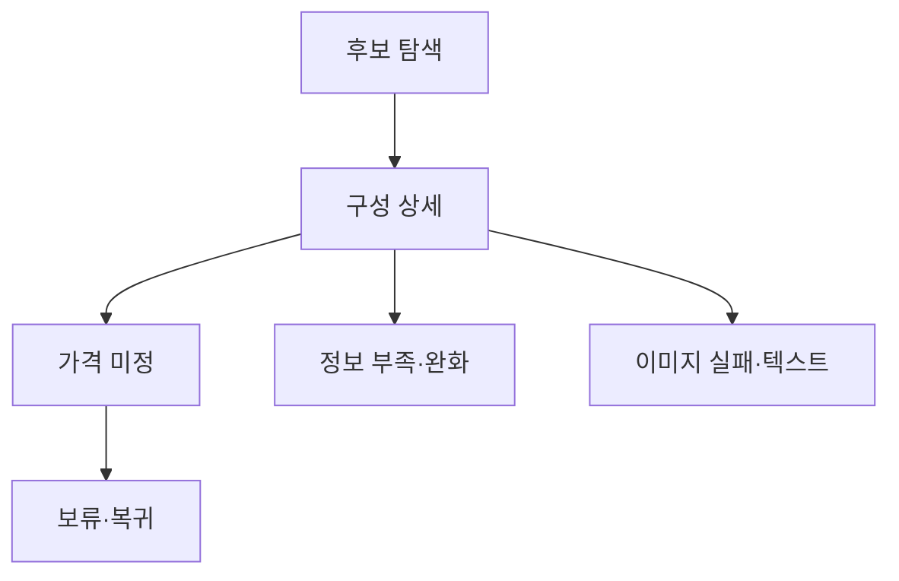

# VC-21 민서 — 사이트구조맵 C안 V3 상세본

## 1. Client·REQ 추적
- Client: VC-21 민서 / 예산 미정 탐색
- 요구·추적: REQ-021, `CR-021`, PAGE-007·008·014·021
- 성공: 가격 없이 구성과 한계를 판단
- 실패: 상대적 저렴함·할인·순위 확정
- 제품: PROD-032 휴대형 분량 조절 노트

### 제품 ID·제품군 배치
- PROD-032 — 휴대형 분량 조절 노트: 사용 상황·구성·보류

## 2. 구조 전략
`제품 탐색 후 가격 보류형` — 후보를 탐색한 뒤 가격 미정과 구매 불가를 명확히 알린다.

## 3. 페이지·콘텐츠·기능 계약
| PAGE | 목적 | 콘텐츠 | 기능·상태 |
|---|---|---|---|
| PAGE-007 | 후보 탐색 | 사용 상황·구성 | 필터 |
| PAGE-008 | 상세 | 크기·분량·준비물 | 비교·보류 |
| PAGE-014 | 가격 안내 | 미정·확인 범위 | 구매 차단 |
| PAGE-021 | 복귀 | 후보군·보류 이유 | 초기화·복귀 |

## 4. 사용자 흐름·상태
- 정상: 후보 → 구성 상세 → 가격 미정 안내 → 보류·복귀
- 분기: 정보 부족 → 전체 후보·조건 완화
- 오류: 이미지 실패에도 구성 텍스트 유지
- 상태: `DEFAULT / EMPTY / ERROR / OFFLINE / RESUME / HOLD`

## 5. 중복·끊김·가정 검증
- 제품 카드에 가격 자리표시자·가짜 할인·순위를 넣지 않는다.
- 구매·결제·배송 CTA를 차단한다.
- 구성 정보와 판매 정책을 다른 섹션으로 분리한다.
- 모바일에서도 가격 미정과 보류 이유를 가로 스크롤 없이 읽는다.

## 6. Mermaid

## 7. 판정
`HOLD / 후보 C` — 탐색은 허용하되 구매 오인을 차단한다.
