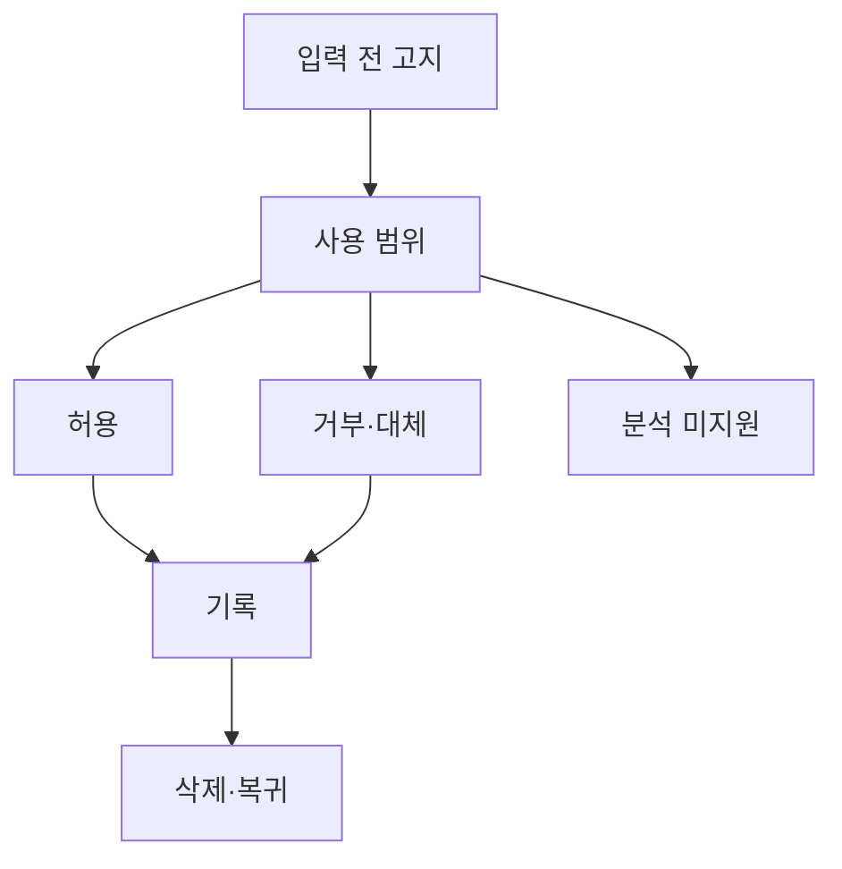

# VC-22 선율 — 사이트구조맵 A안 V3 상세본

## 1. Client·REQ 추적
- Client: VC-22 선율 / 기록 공개 부담
- 요구: 입력 전 사용 범위, 미지원 분석, 거부 가능한 대체 경로
- 수용: 입력 전에 처리 범위를 이해한다.
- 실패: 기록 후에만 정책을 보이거나 감정을 추론
- 추적: REQ-022, `CR-022`, SR-019, ER-010, PAGE-001·010·019
- 제품: PROD-039 감정 선택 없는 회고 패드, PROD-072 감정 비수집 기록지

### 제품 ID·제품군 배치
- PROD-039 — 감정 선택 없는 회고 패드
- PROD-072 — 감정 비수집 기록지

## 2. 구조 전략
`입력 전 고지형` — 수집·사용·미지원 분석을 먼저 고지하고 거부해도 텍스트·수동 대안을 제공한다.

## 3. 페이지·콘텐츠·기능 계약
| PAGE | 목적 | 콘텐츠 | 기능·상태 |
|---|---|---|---|
| PAGE-001 | 고지 진입 | 사용 범위·선택 | 안내·보류 |
| PAGE-010 | 기록 입력 | 동의·대체 경로 | 허용·거부·전환 |
| PAGE-019 | 상태 | 미지원 분석·삭제 | Resume·HOLD |

## 4. 사용자 흐름·상태
- 정상: 입력 전 고지 → 사용 범위 확인 → 허용 또는 대체 → 기록
- 분기: 거부 → 텍스트·수동 기록; 분석 미지원 → 추론 없음 안내
- 오류·Offline: 고지 내용을 유지하고 재시도·나가기 제공
- 상태: `DEFAULT / EMPTY / ERROR / OFFLINE / RESUME / HOLD`

## 5. 중복·끊김·가정 검증
- 감정 추론·자동 분석을 제공한다고 암시하지 않는다.
- 고지 후에만 입력 CTA를 활성화한다.
- 삭제·보존·권한은 근거별 상태로 분리한다.
- 키보드·Label·상태 텍스트·320px·200% 확대를 검증한다.

## 6. Mermaid

## 7. 판정
`KEEP / 후보 A` — 처리 범위를 입력 전에 명확히 한다.
