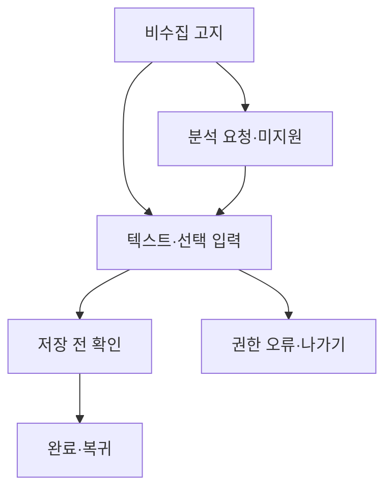

# VC-22 선율 — 사이트구조맵 C안 V3 상세본

## 1. Client·REQ 추적
- Client: VC-22 선율 / 기록 공개 부담
- 요구·추적: REQ-022, `CR-022`, PAGE-001·010·019
- 성공: 거부해도 가능한 대안을 알고 입력한다.
- 실패: 감정을 추론하거나 정책을 뒤늦게 공개
- 제품: PROD-039 감정 선택 없는 회고 패드, PROD-072 감정 비수집 기록지

### 제품 ID·제품군 배치
- PROD-039 — 감정 선택 없는 회고 패드
- PROD-072 — 감정 비수집 기록지

## 2. 구조 전략
`비수집 기본형` — 감정·개인정보 분석을 기본 제공하지 않고 사건·텍스트 기록을 기본 경로로 둔다.

## 3. 페이지·콘텐츠·기능 계약
| PAGE | 목적 | 콘텐츠 | 기능·상태 |
|---|---|---|---|
| PAGE-001 | 방식 선택 | 비수집 원칙·고지 | 개인 기록 선택 |
| PAGE-010 | 입력 | 텍스트·사진 선택 | 거부·삭제 |
| PAGE-019 | 복귀 | 미지원 분석·보존 | Resume·HOLD |

## 4. 사용자 흐름·상태
- 정상: 비수집 고지 → 텍스트·선택 입력 → 저장 전 확인 → 완료
- 분기: 분석 요청 → 미지원 안내·기본 기록 유지
- 오류: 권한·저장 오류 → 입력 없이 나가기·재시도
- 상태: `DEFAULT / EMPTY / ERROR / OFFLINE / RESUME / HOLD`

## 5. 중복·끊김·가정 검증
- 감정·민감 정보의 자동 추론을 금지한다.
- 입력 전 고지와 저장 전 확인을 모두 제공한다.
- 공개·공유·개인화는 근거 없으면 `HOLD`다.
- 모바일에서도 거부·대안·삭제가 보인다.

## 6. Mermaid

## 7. 판정
`KEEP / 후보 C` — 공개 부담과 감정 추론 위험을 기본 경로에서 낮춘다.
