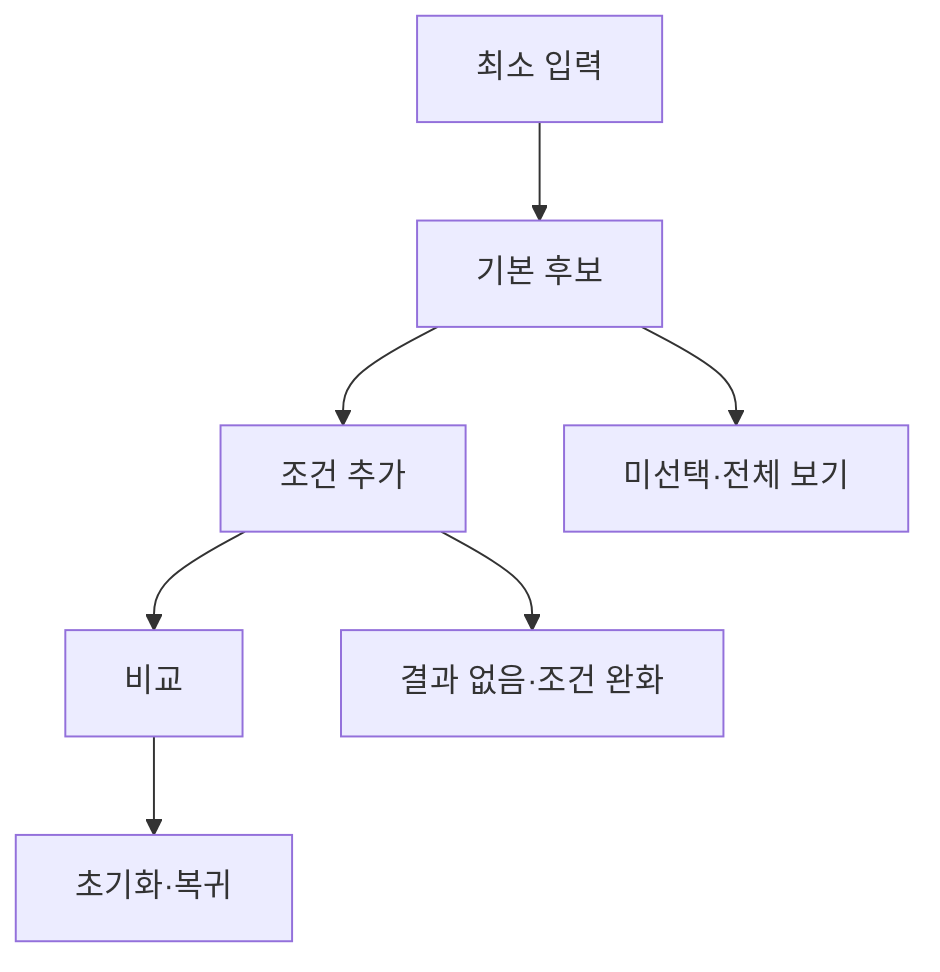

# VC-23 도윤 — 사이트구조맵 A안 V3 상세본

## 1. Client·REQ 추적
- Client: VC-23 도윤 / 복잡한 필터 회피
- 요구: 미선택을 오류로 보지 않고 기본값을 선호로 간주하지 않는다.
- 수용: 최소 입력으로 후보를 보고 원할 때만 조건을 늘린다.
- 실패: 긴 필터·다단계 질문 강제·결과 숨김
- 추적: REQ-023, `CR-023`, SR-001·020, ER-001·004, PAGE-021
- 제품: PROD-012·042·076

### 제품 ID·제품군 배치
- PROD-012 — 기록 방식 비교 템플릿
- PROD-042 — 단계형 조건 선택 카드
- PROD-076 — 주제 검색 인덱스 카드

## 2. 구조 전략
`점진 공개형` — 최소 입력과 기본 후보를 먼저 보여주고 추가 필터는 선택적으로 연다.

## 3. 페이지·콘텐츠·기능 계약
| PAGE | 목적 | 콘텐츠 | 기능·상태 |
|---|---|---|---|
| PAGE-021 | 후보 진입 | 기본 후보·미선택 상태 | 단계형 필터 |
| 비교 | 정밀 판단 | 선택 조건·차이 | 조건 추가·초기화 |
| 공통 | 예외 | Empty·Error·Offline | 결과 유지·복귀 |

## 4. 사용자 흐름·상태
- 정상: 최소 입력 → 기본 후보 → 선택적 조건 추가 → 비교
- 분기: 미선택 → 오류 아님·전체 후보; 결과 없음 → 조건 완화
- 오류: 필터 실패에도 기존 후보와 조건을 보존한다.
- 상태: `DEFAULT / EMPTY / ERROR / OFFLINE / RESUME / HOLD`

## 5. 중복·끊김·가정 검증
- 기본값을 사용자 선호로 저장하지 않는다.
- 필터를 모두 채우도록 강제하지 않는다.
- 결과 수·조건·초기화를 항상 표시한다.
- 키보드·Label·320px·200% 확대를 검증한다.

## 6. Mermaid

## 7. 판정
`KEEP / 후보 A` — 필터 부담을 단계적으로 줄인다.
