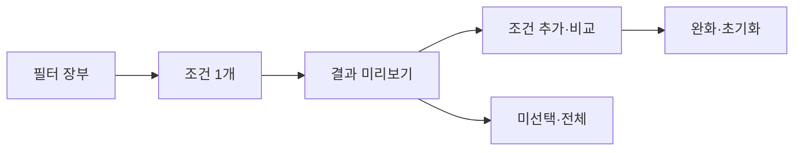

# VC-23 도윤 — 사이트구조맵 B안 V3 상세본

## 1. Client·REQ 추적
- Client: VC-23 도윤 / 복잡한 필터 회피
- 요구·추적: REQ-023, `CR-023`, SR-001·020, ER-001·004, PAGE-021
- 수용: 최소 입력과 선택적 정밀 비교
- 차단: 긴 질문·결과 은닉
- 제품: PROD-012·042·076

### 제품 ID·제품군 배치
- PROD-012 — 기록 방식 비교 템플릿
- PROD-042 — 단계형 조건 선택 카드
- PROD-076 — 주제 검색 인덱스 카드

## 2. 구조 전략
`필터 장부형` — 적용 전 조건·미선택·결과 영향을 한 장부에 보여준다.

## 3. 페이지·콘텐츠·기능 계약
| PAGE | 목적 | 콘텐츠 | 기능·상태 |
|---|---|---|---|
| PAGE-021 | 장부 진입 | 조건·미선택·결과 | 적용 전 미리보기 |
| 비교 | 후보 판단 | 차이·조건 | 선택 필터 |
| 공통 | 실패 대체 | 결과 없음·오류 | 완화·재시도 |

## 4. 사용자 흐름·상태
- 정상: 필터 장부 → 1개 조건 → 결과 미리보기 → 추가 조건·비교
- 분기: 미선택 → 조건 미적용; 결과 없음 → 한 단계 완화
- 오류·Offline: 현재 결과와 조건을 유지한다.
- 상태: `DEFAULT / EMPTY / ERROR / OFFLINE / RESUME / HOLD`

## 5. 중복·끊김·가정 검증
- 적용 전과 적용 후 결과를 구분한다.
- 미선택을 실패·기본 선호로 기록하지 않는다.
- 복잡한 질문을 한 번에 노출하지 않는다.
- 접근성 Label·상태 텍스트·키보드를 제공한다.

## 6. Mermaid

## 7. 판정
`KEEP / 후보 B` — 적용 전후 결과 차이를 명확히 한다.
