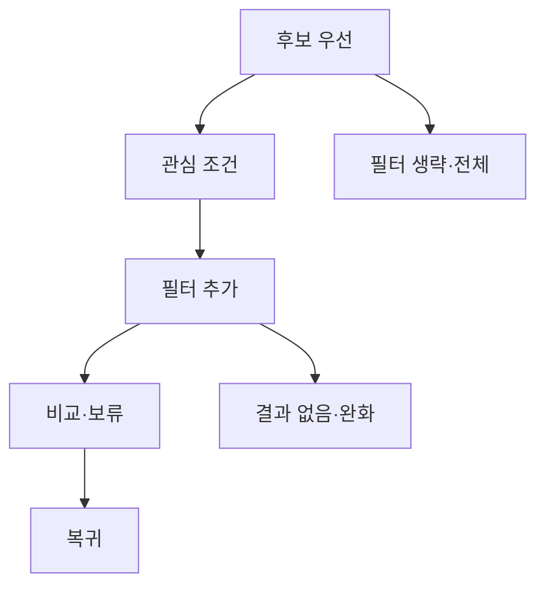

# VC-23 도윤 — 사이트구조맵 C안 V3 상세본

## 1. Client·REQ 추적
- Client: VC-23 도윤 / 복잡한 필터 회피
- 요구·추적: REQ-023, `CR-023`, PAGE-021
- 성공: 조건을 원하는 만큼만 추가하고 후보를 확인
- 실패: 필터 강제·결과 숨김·미선택 오류 처리
- 제품: PROD-012·042·076

### 제품 ID·제품군 배치
- PROD-012 — 기록 방식 비교 템플릿
- PROD-042 — 단계형 조건 선택 카드
- PROD-076 — 주제 검색 인덱스 카드

## 2. 구조 전략
`후보 우선형` — 필터보다 후보와 설명을 먼저 보여주고 필요할 때만 좁힌다.

## 3. 페이지·콘텐츠·기능 계약
| PAGE | 목적 | 콘텐츠 | 기능·상태 |
|---|---|---|---|
| PAGE-021 | 후보 우선 탐색 | 전체·대표 후보 | 선택적 필터 |
| 비교 | 차이 확인 | 조건·속성 | 비교·보류 |
| 공통 | 예외 | Empty·Error·Resume | 조건 유지·복귀 |

## 4. 사용자 흐름·상태
- 정상: 후보 보기 → 관심 조건 선택 → 필터 추가 → 비교·보류
- 분기: 필터 생략 → 전체 후보; 결과 없음 → 생략·완화
- 오류: 카드 실패 시 남은 후보와 텍스트 상태 보존
- 상태: `DEFAULT / EMPTY / ERROR / OFFLINE / RESUME / HOLD`

## 5. 중복·끊김·가정 검증
- 후보를 숨긴 채 필터부터 요구하지 않는다.
- 미선택은 빈 값이며 오류가 아니다.
- 자동 기본값·선호 추정은 금지한다.
- 모바일에서도 후보·필터·초기화를 세로로 제공한다.

## 6. Mermaid

## 7. 판정
`KEEP / 후보 C` — 탐색 시작의 부담을 최소화한다.
