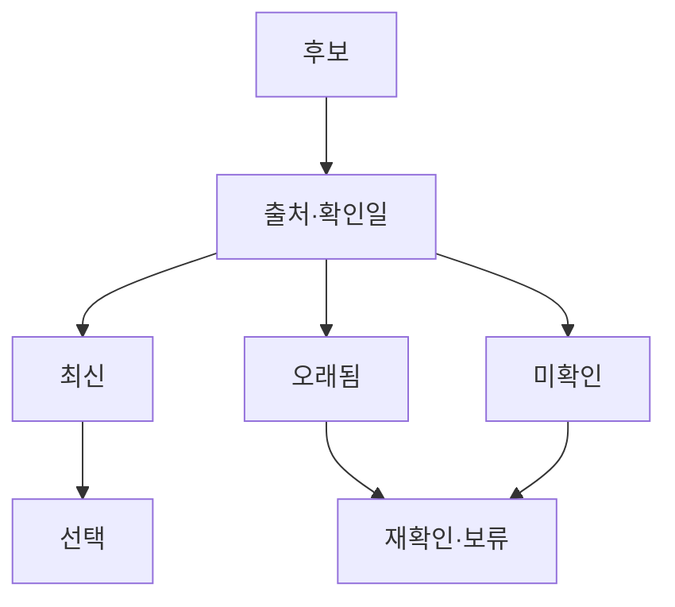

# VC-24 아라 — 사이트구조맵 A안 V3 상세본

## 1. Client·REQ 추적
- Client: VC-24 아라 / 근거 시점 확인
- 요구: 출처·시점·변경 가능성, 최신·오래됨·미확인 구분
- 수용: 상태별로 선택 또는 보류
- 실패: 확인일 없는 값을 확인 완료로 표시
- 추적: REQ-024, `CR-024`, SR-019, ER-016, PAGE-007·008·014·020·021
- 제품: PROD-003 물성 확인 기록 샘플러, PROD-063 종이 구조 비교 카드

### 제품 ID·제품군 배치
- PROD-003 — 물성 확인 기록 샘플러
- PROD-063 — 종이 구조 비교 카드

## 2. 구조 전략
`최신성 우선형` — 모든 근거 카드에 출처·확인일·상태·변경 가능성을 고정한다.

## 3. 페이지·콘텐츠·기능 계약
| PAGE | 목적 | 콘텐츠 | 기능·상태 |
|---|---|---|---|
| PAGE-007 | 근거 탐색 | 재료·출처·시점 | 최신성 필터 |
| PAGE-008 | 상세 | 상태·변경 위험 | 보류·출처 보기 |
| PAGE-014 | 비교 | 최신·오래됨·미확인 | 비교·복귀 |
| PAGE-020 | 브랜드 주장 | 확인일·한계 | 근거 펼치기 |
| PAGE-021 | 전체 후보 | 상태별 제품 | 조건 완화 |

## 4. 사용자 흐름·상태
- 정상: 후보 → 출처·확인일 → 최신성 상태 → 선택·보류
- 분기: 오래됨 → 경고·재확인; 미확인 → 선택 차단·보류
- 오류·Offline: 마지막 확인일과 변경 가능성을 표시한다.
- 상태: `DEFAULT / EMPTY / ERROR / OFFLINE / RESUME / HOLD`

## 5. 중복·끊김·가정 검증
- 확인됨·최신·오래됨·미확인을 별도 상태로 둔다.
- 확인일 없는 값은 `확인 완료`로 표시하지 않는다.
- 인증·수치·재료·수리 정보는 출처와 시점을 연결한다.
- 키보드·Label·상태 텍스트·320px·200% 확대를 검증한다.

## 6. Mermaid

## 7. 판정
`KEEP / 후보 A` — 최신성·근거 상태를 가장 명확히 전달한다.
