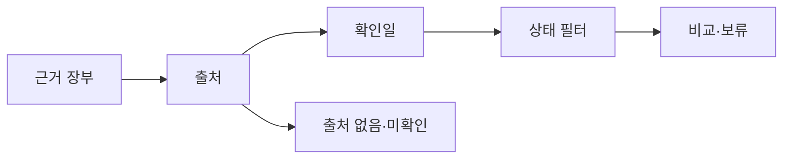

# VC-24 아라 — 사이트구조맵 B안 V3 상세본

## 1. Client·REQ 추적
- Client: VC-24 아라 / 근거 시점 확인
- 요구·추적: REQ-024, `CR-024`, SR-019, ER-016, PAGE-007·008·014·020·021
- 수용: 최신·오래됨·미확인 분리
- 차단: 확인일 없는 완료 표시
- 제품: PROD-003 물성 확인 기록 샘플러, PROD-063 종이 구조 비교 카드

### 제품 ID·제품군 배치
- PROD-003 — 물성 확인 기록 샘플러
- PROD-063 — 종이 구조 비교 카드

## 2. 구조 전략
`근거 장부형` — 주장·출처·확인일·상태·다음 확인 행동을 장부로 비교한다.

## 3. 페이지·콘텐츠·기능 계약
| PAGE | 목적 | 콘텐츠 | 기능·상태 |
|---|---|---|---|
| PAGE-007 | 장부 진입 | 출처·시점 | 상태 필터 |
| PAGE-008 | 상세 | 변경 위험·한계 | 근거 보기 |
| PAGE-014 | 비교 | 상태별 후보 | 보류·복귀 |
| PAGE-020 | 주장 검증 | 브랜드 근거 | 출처 펼치기 |
| PAGE-021 | 전체 | 상태 요약 | 조건 완화 |

## 4. 사용자 흐름·상태
- 정상: 장부 → 상태 필터 → 후보 비교 → 선택·보류
- 분기: 시점 경과 → 재확인; 출처 없음 → 미확인·선택 차단
- 오류·Offline: 장부 마지막 확인일 유지
- 상태: `DEFAULT / EMPTY / ERROR / OFFLINE / RESUME / HOLD`

## 5. 중복·끊김·가정 검증
- 장부와 제품 상세는 ID·출처로 연결한다.
- 최신성은 날짜·상태 텍스트로 제공한다.
- 오래됨을 미확인과 같은 상태로 합치지 않는다.
- 접근성 Heading·키보드·대체 텍스트를 제공한다.

## 6. Mermaid

## 7. 판정
`KEEP / 후보 B` — 근거 변경과 후속 행동을 추적하기 쉽다.
