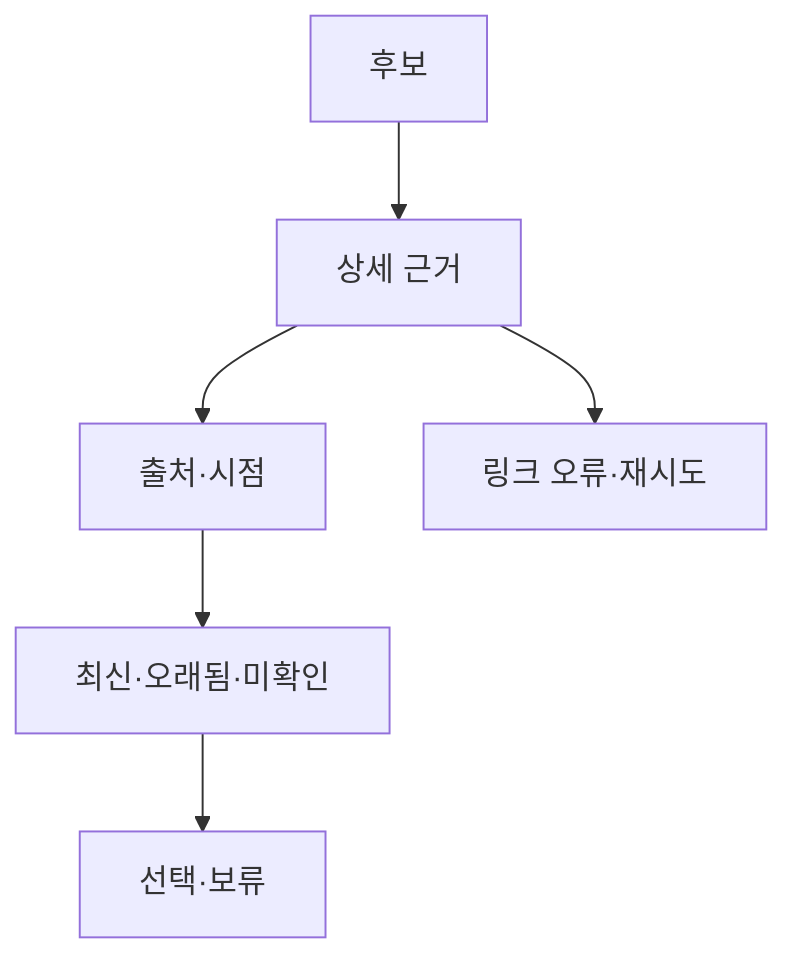

# VC-24 아라 — 사이트구조맵 C안 V3 상세본

## 1. Client·REQ 추적
- Client: VC-24 아라 / 근거 시점 확인
- 요구·추적: REQ-024, `CR-024`, PAGE-007·008·014·020·021
- 성공: 선택 전 최신성·미확인을 판단
- 실패: 날짜 없는 근거를 완료로 표시
- 제품: PROD-003 물성 확인 기록 샘플러, PROD-063 종이 구조 비교 카드

### 제품 ID·제품군 배치
- PROD-003 — 물성 확인 기록 샘플러
- PROD-063 — 종이 구조 비교 카드

## 2. 구조 전략
`제품 상세 검증형` — 후보 탐색을 허용하되 상세에서 출처·확인일·상태를 확인하게 한다.

## 3. 페이지·콘텐츠·기능 계약
| PAGE | 목적 | 콘텐츠 | 기능·상태 |
|---|---|---|---|
| PAGE-007 | 후보 탐색 | 재료·정책 후보 | 필터 |
| PAGE-008 | 근거 상세 | 출처·시점·변경 위험 | 비교·보류 |
| PAGE-014 | 상태 비교 | 최신·오래됨·미확인 | 선택·복귀 |
| PAGE-020 | 브랜드 근거 | 주장·사실 경계 | 출처 보기 |
| PAGE-021 | 전체 후보 | 상태 요약 | 조건 완화 |

## 4. 사용자 흐름·상태
- 정상: 후보 → 상세 근거 → 상태 판단 → 선택·보류
- 분기: 오래됨 → 경고; 미확인 → 보류·재탐색
- 오류: 출처 링크 실패 → 상태 유지·재시도
- 상태: `DEFAULT / EMPTY / ERROR / OFFLINE / RESUME / HOLD`

## 5. 중복·끊김·가정 검증
- 제품 이미지·브랜드 문구가 확인일을 대신하지 않는다.
- 가격·인증·수치는 근거 시점 없으면 확정하지 않는다.
- 모바일에서도 상태와 출처를 세로로 읽는다.
- 키보드·상태 텍스트·포커스 순서를 검증한다.

## 6. Mermaid

## 7. 판정
`KEEP / 후보 C` — 탐색과 근거 확인의 균형을 맞춘다.
