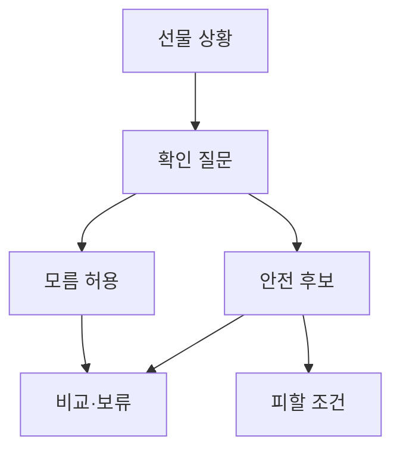

# VC-25 재희 — 사이트구조맵 A안 V3 상세본

## 1. Client·REQ 추적
- Client: VC-25 재희 / 선물 실패 회피
- 요구: 모름 허용·확인 질문·보류 이유·단정 추천 금지
- 수용: 받는 사람에게 물을 것과 피할 후보를 구분
- 실패: 가상 후기·구매 완료·성격 기반 추천
- 추적: REQ-025, `CR-025`, SR-002·019·020, ER-006·007, PAGE-001·020·021
- 제품: PROD-022·024·052·054·089

### 제품 ID·제품군 배치
- PROD-022 — 선물 상황 선택 카드
- PROD-024 — 관계·용도 확인 질문
- PROD-052 — 선물 안전 후보 묶음
- PROD-054 — 피할 조건 비교 카드
- PROD-089 — 선물 취향 확인표

## 2. 구조 전략
`질문 후 후보형` — 모름을 허용하고 최소 확인 질문 뒤 안전 후보와 피할 조건을 보여준다.

## 3. 페이지·콘텐츠·기능 계약
| PAGE | 목적 | 콘텐츠 | 기능·상태 |
|---|---|---|---|
| PAGE-001 | 선물 진입 | 상황·모름·질문 | 질문 건너뛰기 |
| PAGE-020 | 기준 확인 | 관계·취향·한계 | 근거·보류 |
| PAGE-021 | 후보 비교 | 안전 후보·피할 조건 | 비교·복귀 |

## 4. 사용자 흐름·상태
- 정상: 선물 상황 → 질문 또는 모름 → 안전 후보 → 비교·보류
- 분기: 답변 거부 → 모름 후보; 피할 조건 확인 → 후보 제외
- 오류·Empty: 후보 없음·질문 취소를 분리하고 조건 완화 제공
- 상태: `DEFAULT / EMPTY / ERROR / OFFLINE / RESUME / HOLD`

## 5. 중복·끊김·가정 검증
- 상대의 성격·취향을 추정하지 않는다.
- 가상 후기·구매 CTA·가격은 근거 없으면 표시하지 않는다.
- 질문과 보류 이유를 저장하되 타인 개인정보는 추정하지 않는다.
- 키보드·Label·상태 텍스트·모바일 레일을 검증한다.

## 6. Mermaid

## 7. 판정
`KEEP / 후보 A` — 질문과 모름을 함께 제공한다.
