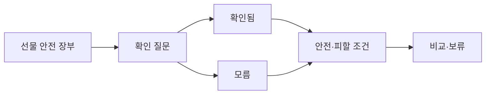

# VC-25 재희 — 사이트구조맵 B안 V3 상세본

## 1. Client·REQ 추적
- Client: VC-25 재희 / 선물 실패 회피
- 요구·추적: REQ-025, `CR-025`, SR-002·019·020, ER-006·007, PAGE-001·020·021
- 수용: 확인 질문·피할 후보·보류 이유를 구분
- 차단: 가상 후기·성격 추천·구매 완료
- 제품: PROD-022·024·052·054·089

### 제품 ID·제품군 배치
- PROD-022 — 선물 상황 선택 카드
- PROD-024 — 관계·용도 확인 질문
- PROD-052 — 선물 안전 후보 묶음
- PROD-054 — 피할 조건 비교 카드
- PROD-089 — 선물 취향 확인표

## 2. 구조 전략
`선물 안전 장부형` — 후보마다 확인됨·모름·피할 조건·보류 이유를 장부로 비교한다.

## 3. 페이지·콘텐츠·기능 계약
| PAGE | 목적 | 콘텐츠 | 기능·상태 |
|---|---|---|---|
| PAGE-001 | 장부 진입 | 선물 맥락·모름 | 상태 선택 |
| PAGE-020 | 기준 | 확인 질문·한계 | 질문·보류 |
| PAGE-021 | 후보 | 안전·피할 조건 | 비교·초기화 |

## 4. 사용자 흐름·상태
- 정상: 안전 장부 → 확인 질문 → 후보 상태 → 비교·보류
- 분기: 모름 → 안전 후보; 질문 답변 → 조건 좁히기
- 오류·Offline: 질문·선택 상태를 유지하고 재시도
- 상태: `DEFAULT / EMPTY / ERROR / OFFLINE / RESUME / HOLD`

## 5. 중복·끊김·가정 검증
- 안전 후보를 정답·추천 순위로 표시하지 않는다.
- 확인 질문과 구매 행동을 분리한다.
- 가격·배송·후기는 `HOLD`다.
- 접근성 Heading·키보드·대체 텍스트를 제공한다.

## 6. Mermaid

## 7. 판정
`KEEP / 후보 B` — 선물 후보의 근거와 보류 사유를 추적한다.
