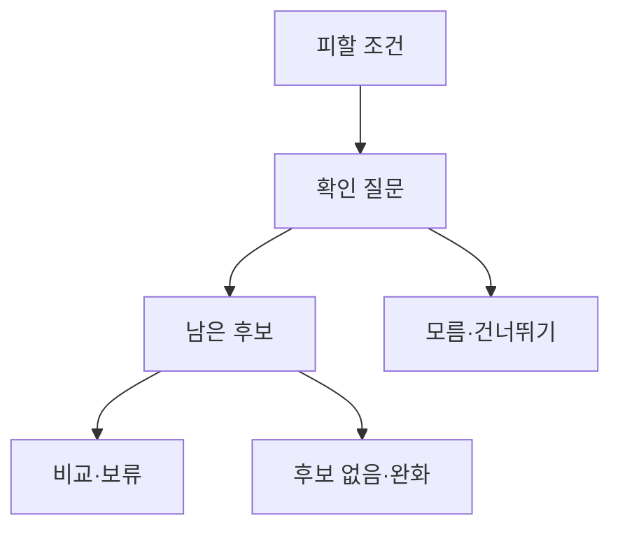

# VC-25 재희 — 사이트구조맵 C안 V3 상세본

## 1. Client·REQ 추적
- Client: VC-25 재희 / 선물 실패 회피
- 요구·추적: REQ-025, `CR-025`, PAGE-001·020·021
- 성공: 피할 후보와 질문을 구분해 보류
- 실패: 성격 추정·가상 후기·구매 CTA
- 제품: PROD-022·024·052·054·089

### 제품 ID·제품군 배치
- PROD-022 — 선물 상황 선택 카드
- PROD-024 — 관계·용도 확인 질문
- PROD-052 — 선물 안전 후보 묶음
- PROD-054 — 피할 조건 비교 카드
- PROD-089 — 선물 취향 확인표

## 2. 구조 전략
`피할 조건 우선형` — 선물 받는 사람에게 물을 질문과 먼저 제외할 조건을 보여준 뒤 후보를 탐색한다.

## 3. 페이지·콘텐츠·기능 계약
| PAGE | 목적 | 콘텐츠 | 기능·상태 |
|---|---|---|---|
| PAGE-001 | 안전 진입 | 모름·피할 조건 | 선택·건너뛰기 |
| PAGE-020 | 질문 | 관계·사용 장면 | 확인·보류 |
| PAGE-021 | 후보 | 제외 조건·안전 후보 | 비교·복귀 |

## 4. 사용자 흐름·상태
- 정상: 피할 조건 → 질문 선택 → 남은 후보 → 보류
- 분기: 질문 건너뛰기 → 모름 상태; 후보 없음 → 조건 완화
- 오류: 이미지·후기 실패를 텍스트 상태로 표시
- 상태: `DEFAULT / EMPTY / ERROR / OFFLINE / RESUME / HOLD`

## 5. 중복·끊김·가정 검증
- 피할 조건을 받는 사람의 성격으로 확장하지 않는다.
- 후보 이름만으로 적합성을 단정하지 않는다.
- 구매·결제·후기·가격은 확정하지 않는다.
- 모바일에서도 질문·모름·보류가 보인다.

## 6. Mermaid

## 7. 판정
`KEEP / 후보 C` — 실패 위험을 먼저 줄인 뒤 후보를 보여준다.
