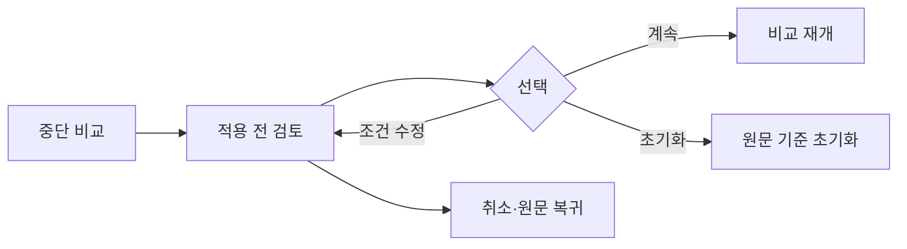

# VC-26 지후 사이트구조맵 A안 V3 — 확인 후 비교 재개형

## 1. Client·REQ 추적
- Client: VC-26 지후(중단 후 비교 맥락), REQ-026.
- 핵심 요구: 적용 전 검토, 오래된 근거 표시, 취소·원문 복귀를 보장한 뒤 비교를 재개한다.
- 연결 제품: PROD-015 — 다시 시작 기록 세트 / PROD-045 — 이어쓰기 위치 북마크 / PROD-080 — 복귀 맥락 북마크.

## 2. 구조 전략
- 중단 상태를 먼저 보여주고, 적용 전 미리보기에서 범위·확인일·오래된 근거를 검토한다.
- 계속·조건 수정·안전 초기화를 분리해 자동 갱신과 자동 적용을 차단한다.

## 3. 페이지·콘텐츠·기능 계약
- PAGE-019 중단 비교 진입: 마지막 위치, 선택 조건, 최신성 배지.
- PAGE-021 적용 전 검토: 변경 범위, 원문 보기, 취소, 계속, 초기화.
- 비교 결과: 근거별 상태와 재개 지점을 유지하며 실패 시 원문으로 복귀한다.

## 4. 사용자 흐름·상태
- 메인 → 중단 비교 → 적용 전 검토 → (계속 / 조건 수정 / 초기화) → 비교 결과.
- 상태: 대기, 검토 중, 오래된 근거 경고, 재개 완료, 취소 복귀, 오류·오프라인·HOLD.

## 5. 중복·끊김·가정 검증
- 오래된 근거를 최신으로 바꾸거나 자동 적용하지 않는다고 가정한다.
- 취소 시 원문·조건·중단 위치가 보존되어야 하며, 네트워크 실패는 재시도와 초기화를 구분한다.

## 6. Mermaid

## 7. 판정
- KEEP / INFERENCE: 확인 게이트와 원문 복귀를 제품 연결과 함께 유지한다.

