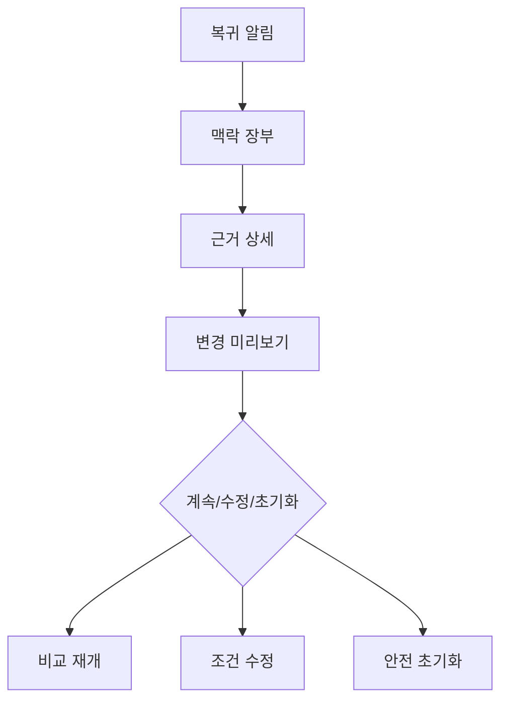

# VC-26 지후 사이트구조맵 B안 V3 — 맥락 장부형

## 1. Client·REQ 추적
- Client: VC-26 지후, REQ-026.
- 요구: 중단 후 비교의 근거·조건·복귀 위치를 장부처럼 확인하고 재개한다.
- 연결 제품: PROD-015 — 다시 시작 기록 세트 / PROD-045 — 이어쓰기 위치 북마크 / PROD-080 — 복귀 맥락 북마크.

## 2. 구조 전략
- 비교 화면을 맥락 요약, 근거 목록, 변경 미리보기, 실행 선택의 4영역으로 나눈다.
- 각 영역에 확인일과 상태를 노출해 오래된 근거를 숨기지 않는다.

## 3. 페이지·콘텐츠·기능 계약
- PAGE-019: 중단 위치와 다음 행동을 복원한다.
- PAGE-021: 원문·변경본을 나란히 보고 계속, 수정, 초기화를 선택한다.
- 저장: 확인한 조건과 선택을 기록하되, 적용은 사용자 명시 동작으로만 실행한다.

## 4. 사용자 흐름·상태
- 복귀 알림 → 맥락 장부 → 근거 상세 → 변경 미리보기 → 계속/수정/초기화.
- 상태: 동기화 대기, 최신, 오래됨, 확인 필요, 취소됨, 복귀 완료, 오류.

## 5. 중복·끊김·가정 검증
- PROD-045와 PROD-080은 위치와 조건을 각각 담당하며 동일 정보를 중복 확정하지 않는다.
- 자동 갱신·자동 적용은 금지하고, 오프라인에서는 읽기와 초기화만 허용한다.

## 6. Mermaid

## 7. 판정
- KEEP / INFERENCE: 맥락 기록과 검토 게이트를 분리해 추적성을 확보한다.

