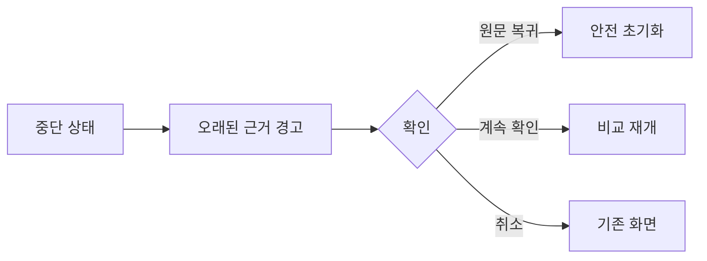

# VC-26 지후 사이트구조맵 C안 V3 — 안전 초기화 우선형

## 1. Client·REQ 추적
- Client: VC-26 지후, REQ-026.
- 요구: 불확실한 오래된 근거는 적용하지 않고 원문으로 되돌린 후 비교를 다시 시작한다.
- 연결 제품: PROD-015 — 다시 시작 기록 세트 / PROD-045 — 이어쓰기 위치 북마크 / PROD-080 — 복귀 맥락 북마크.

## 2. 구조 전략
- 신뢰도 낮은 근거를 만나면 초기화를 기본 제안으로 하고, 계속은 명시적 확인 뒤 허용한다.
- 취소와 원문 복귀를 모든 검토 단계에서 고정 제공한다.

## 3. 페이지·콘텐츠·기능 계약
- PAGE-019: 복귀 조건과 마지막 비교 위치를 표시한다.
- PAGE-021: 위험 근거, 영향 범위, 원문 복귀, 초기화, 계속을 계약한다.
- 오류·오프라인에서는 적용 버튼을 비활성화하고 원문 보기와 재시도만 제공한다.

## 4. 사용자 흐름·상태
- 중단 감지 → 오래된 근거 경고 → 원문 복귀 또는 확인 → 비교 재개.
- 상태: 경고, 초기화 권장, 사용자 확인, 재개, 취소, 실패·HOLD.

## 5. 중복·끊김·가정 검증
- 최신성 불명확 시 보수적으로 초기화하며, 기록·북마크의 손실은 없어야 한다.
- 재시도 후에도 근거가 불명확하면 비교를 멈추고 수동 검토로 전환한다.

## 6. Mermaid

## 7. 판정
- KEEP / INFERENCE: 불확실성은 초기화로 격리하고 사용자 확인 뒤에만 재개한다.

