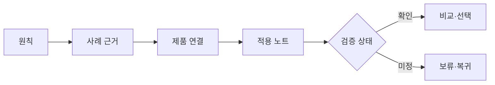

# VC-27 예린 사이트구조맵 A안 V3 — 근거 공개형 브랜드 검증

## 1. Client·REQ 추적
- Client: VC-27 예린(브랜드 주장 검증), REQ-027.
- 요구: 원칙을 화면·제품 결정 근거로 사용하고 미정 범위를 숨기지 않는다.
- 연결 제품: PROD-028 — 브랜드 원칙 사례 카드 / PROD-058 — 브랜드 원칙·Client 연결 지도 / PROD-097 — 브랜드 원칙 적용 노트.

## 2. 구조 전략
- 브랜드 원칙 → 사례 근거 → 제품 적용 → 제한·미정 상태 순으로 공개한다.
- 인증·성과·연혁·효과는 근거가 없으면 주장하지 않고 보류 상태로 표시한다.

## 3. 페이지·콘텐츠·기능 계약
- PAGE-001 랜딩: 원칙 요약과 근거 보기 진입.
- PAGE-020 브랜드 소개: 원칙별 사례·적용 범위·제한.
- PAGE-021 상세/비교: 제품 근거와 미확인 주장 구분, 보류·복귀·재시도.

## 4. 사용자 흐름·상태
- 랜딩 → 원칙 선택 → 사례 카드 → 제품 연결 지도 → 적용 노트 → 비교/보류.
- 상태: 확인됨, 부분 확인, 미정, 근거 부족, 오류·재시도, 취소·복귀.

## 5. 중복·끊김·가정 검증
- 사례 카드와 적용 노트는 출처·범위를 공유하되 동일 주장을 중복 확정하지 않는다.
- 미정 범위는 빈칸으로 숨기지 않고 제한 문구와 대체 경로를 제공한다.

## 6. Mermaid

## 7. 판정
- KEEP / INFERENCE: 근거가 확인된 주장만 결정에 사용하고 미정 범위를 명시한다.

