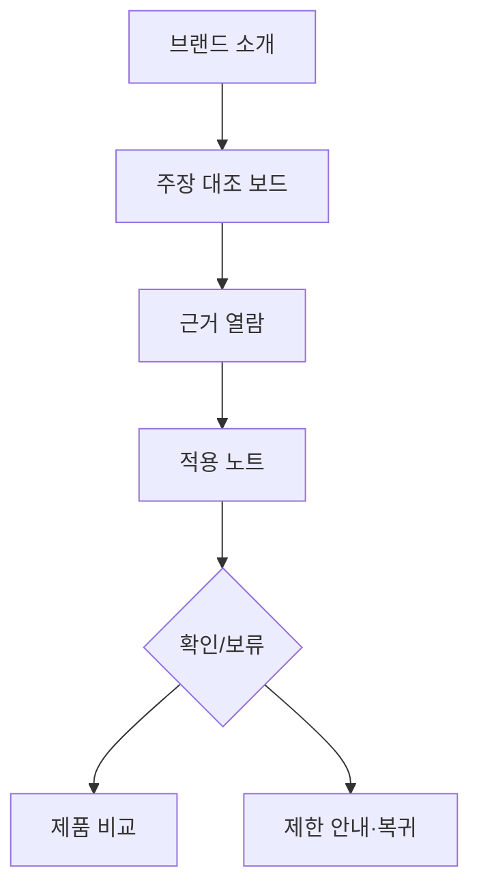

# VC-27 예린 사이트구조맵 B안 V3 — 주장 대조 보드형

## 1. Client·REQ 추적
- Client: VC-27 예린, REQ-027.
- 핵심: 최소 한 원칙의 실제 적용과 제한을 설명하고 근거 없는 확대를 막는다.
- 연결 제품: PROD-028 — 브랜드 원칙 사례 카드 / PROD-058 — 브랜드 원칙·Client 연결 지도 / PROD-097 — 브랜드 원칙 적용 노트.

## 2. 구조 전략
- 주장, 근거, 적용, 제한을 4열 대조 보드로 고정한다.
- 사용자는 각 행에서 확인·보류·원문 보기를 선택하며 자동 확정을 하지 않는다.

## 3. 페이지·콘텐츠·기능 계약
- PAGE-020에 원칙별 대조 보드와 출처를 제공한다.
- PAGE-021에서 제품별 적용 노트와 금지 주장 경고를 제공한다.
- 오류 시 재시도·취소·대체 행동을 유지하고 원래 탐색 위치로 돌아간다.

## 4. 사용자 흐름·상태
- 브랜드 소개 → 주장 행 선택 → 근거 열람 → 적용 노트 → 확인/보류.
- 상태: 대조 중, 확인, 제한 있음, 근거 부족, 차단, 복귀.

## 5. 중복·끊김·가정 검증
- 연결 지도는 관계를 설명하고 사례 카드는 사례만 설명해 역할을 분리한다.
- 인증·성과·연혁·효과는 출처가 없으면 보류·차단 처리한다.

## 6. Mermaid

## 7. 판정
- KEEP / INFERENCE: 주장과 근거의 행 단위 대조를 통해 과장을 차단한다.

