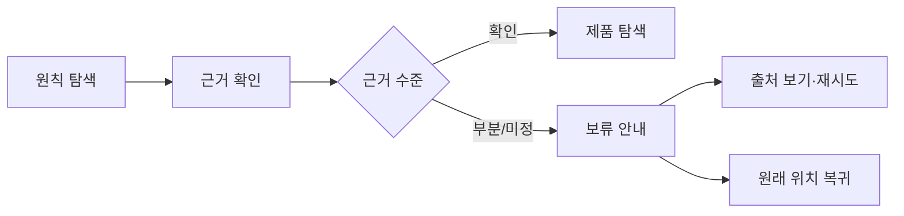

# VC-27 예린 사이트구조맵 C안 V3 — 보류 우선 안전형

## 1. Client·REQ 추적
- Client: VC-27 예린, REQ-027.
- 요구: 근거 없는 인증·성과·연혁·효과 주장을 만들지 않고 미정 범위를 보류한다.
- 연결 제품: PROD-028 — 브랜드 원칙 사례 카드 / PROD-058 — 브랜드 원칙·Client 연결 지도 / PROD-097 — 브랜드 원칙 적용 노트.

## 2. 구조 전략
- 원칙을 먼저 제시하되 근거가 부족하면 안전하게 보류하고 사용자에게 제한을 알린다.
- 제품 선택은 확인된 원칙 적용이 있을 때만 활성화한다.

## 3. 페이지·콘텐츠·기능 계약
- PAGE-001: 원칙·검증 상태를 짧게 안내한다.
- PAGE-020: 근거 수준과 제한을 공개한다.
- PAGE-021: 확인된 적용, 보류, 오류·재시도, 원문 복귀를 계약한다.

## 4. 사용자 흐름·상태
- 원칙 탐색 → 근거 확인 → (적용 확인 / 보류) → 제품 탐색 또는 복귀.
- 상태: 확인, 부분 확인, 보류 권장, 차단, 오류, 취소·복귀.

## 5. 중복·끊김·가정 검증
- 근거가 갱신되지 않은 경우 기존 내용을 최신 사실처럼 표시하지 않는다.
- 보류에서도 원칙·출처·다음 확인 행동을 잃지 않도록 유지한다.

## 6. Mermaid

## 7. 판정
- KEEP / INFERENCE: 보류를 정상 상태로 설계해 근거 없는 브랜드 주장을 차단한다.

