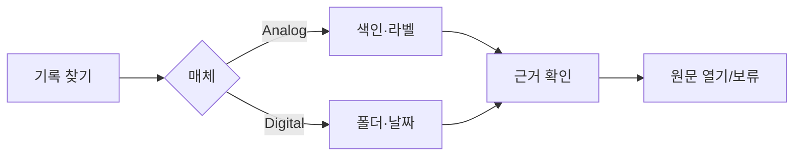

# VC-28 수현 사이트구조맵 A안 V3 — 매체 분리 재탐색형

## 1. Client·REQ 추적
- Client: VC-28 수현(오래된 기록 재탐색), REQ-028.
- 요구: Analog와 Digital의 재탐색 방법을 분리하고 자동 기능을 과장하지 않는다.
- 연결 제품: PROD-008 — 사진 포켓 회고 리필 / PROD-011 — 주제 인덱스 바인더 / PROD-027 — 오래된 기록 재탐색 키트 / PROD-037 — 사진 한 줄 보관 카드 / PROD-056 — 기록물 보관 라벨 세트 / PROD-061 — 월간 장문 아카이브 / PROD-070 — 사진 맥락 라벨 / PROD-093 — 보관 매체 확인표.

## 2. 구조 전략
- 매체 선택을 첫 단계로 두고 Analog는 색인·라벨, Digital은 폴더·날짜·수동 검색으로 안내한다.
- OCR·AI 검색·영구 보존은 지원한다고 확정하지 않고 한계를 명시한다.

## 3. 페이지·콘텐츠·기능 계약
- PAGE-001 진입, PAGE-012 기록 목록, PAGE-016 사진·맥락, PAGE-019 재개, PAGE-020 보관 안내.
- 매체별 탐색법, 예상 한계, 원문 보기, 보류·복귀·재시도 제공.

## 4. 사용자 흐름·상태
- 기록 찾기 → 매체 선택 → 색인/폴더 탐색 → 근거 확인 → 원문 열기 또는 보류.
- 상태: 탐색 중, 찾음, 부분 확인, 찾지 못함, 오류·재시도, 취소·복귀.

## 5. 중복·끊김·가정 검증
- 사진 카드와 맥락 라벨은 보조 근거이며 OCR 자동 추출을 전제하지 않는다.
- 보관 매체 확인표는 위치를 기록하지만 영구 보존을 보장하지 않는다.

## 6. Mermaid

## 7. 판정
- KEEP / INFERENCE: 매체별 재탐색 한계를 설명하고 자동 검색을 과장하지 않는다.

