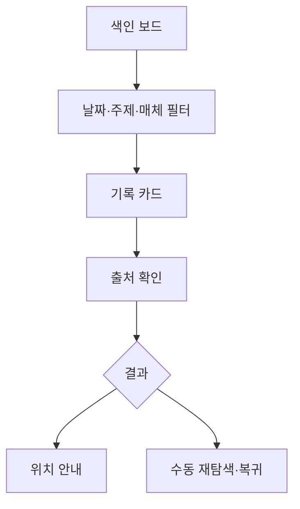

# VC-28 수현 사이트구조맵 B안 V3 — 색인 보드형

## 1. Client·REQ 추적
- Client: VC-28 수현, REQ-028.
- 수용 조건: 매체별로 다시 찾는 방법과 한계를 설명한다.
- 연결 제품: PROD-008 — 사진 포켓 회고 리필 / PROD-011 — 주제 인덱스 바인더 / PROD-027 — 오래된 기록 재탐색 키트 / PROD-037 — 사진 한 줄 보관 카드 / PROD-056 — 기록물 보관 라벨 세트 / PROD-061 — 월간 장문 아카이브 / PROD-070 — 사진 맥락 라벨 / PROD-093 — 보관 매체 확인표.

## 2. 구조 전략
- 기록을 날짜·주제·매체 색인으로 나누고 사용자가 직접 선택한다.
- 검색 불가 영역은 미확인으로 남기며 OCR·AI·영구 보존을 임의로 약속하지 않는다.

## 3. 페이지·콘텐츠·기능 계약
- PAGE-012 색인 보드, PAGE-016 사진 맥락, PAGE-019 재개, PAGE-020 보관 한계.
- 결과에는 경로, 확인일, 출처, 다음 수동 행동을 표시한다.

## 4. 사용자 흐름·상태
- 색인 보드 → 필터 선택 → 기록 카드 → 출처 확인 → 저장 위치 안내.
- 상태: 필터 적용, 결과 있음, 결과 없음, 부분 확인, 오류, 복귀.

## 5. 중복·끊김·가정 검증
- 주제 인덱스와 라벨 세트가 같은 위치를 중복 주장하지 않도록 출처를 병기한다.
- 자동 분류 실패 시 수동 색인으로 전환한다.

## 6. Mermaid

## 7. 판정
- KEEP / INFERENCE: 색인과 출처를 사용자 조작 중심으로 제공한다.

