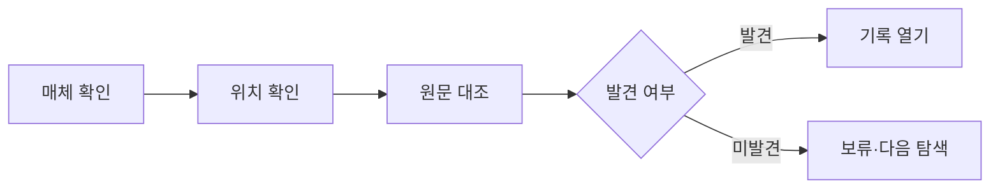

# VC-28 수현 사이트구조맵 C안 V3 — 수동 확인 우선형

## 1. Client·REQ 추적
- Client: VC-28 수현, REQ-028.
- 실패 조건: OCR·AI 검색·영구 보존을 근거 없이 제공한다.
- 연결 제품: PROD-008 — 사진 포켓 회고 리필 / PROD-011 — 주제 인덱스 바인더 / PROD-027 — 오래된 기록 재탐색 키트 / PROD-037 — 사진 한 줄 보관 카드 / PROD-056 — 기록물 보관 라벨 세트 / PROD-061 — 월간 장문 아카이브 / PROD-070 — 사진 맥락 라벨 / PROD-093 — 보관 매체 확인표.

## 2. 구조 전략
- 자동 검색 대신 사용자가 매체와 저장 위치를 확인하는 안전한 재탐색 절차를 제공한다.
- 찾지 못한 기록은 손실로 단정하지 않고 보류·다음 행동으로 남긴다.

## 3. 페이지·콘텐츠·기능 계약
- PAGE-001 안내, PAGE-012 목록, PAGE-016 맥락, PAGE-019 재개, PAGE-020 보관.
- 각 단계에 출처, 수동 확인, 재시도, 취소·복귀를 고정한다.

## 4. 사용자 흐름·상태
- 매체 확인 → 저장 위치 확인 → 원문 대조 → 발견/보류 → 다음 탐색.
- 상태: 확인 필요, 수동 대조, 발견, 미발견, 보류, 오류·복귀.

## 5. 중복·끊김·가정 검증
- 한 줄 카드·사진 라벨은 맥락 보조이며 원문을 대체하지 않는다.
- 매체 확인표는 보관 상태를 기록하지만 접근 가능성을 보장하지 않는다.

## 6. Mermaid

## 7. 판정
- KEEP / INFERENCE: 수동 확인과 한계 고지를 기본값으로 유지한다.

