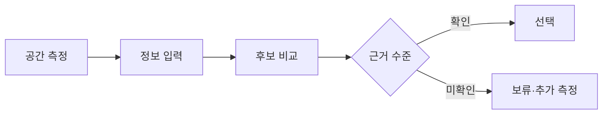

# VC-29 건우 사이트구조맵 A안 V3 — 실측 기반 보관 선택형

## 1. Client·REQ 추적
- Client: VC-29 건우(실물 보관 공간 제약), REQ-029.
- 요구: 실측 가능한 공간 정보와 미확인 보관 효과를 분리한다.
- 연결 제품: PROD-025 — 보관 단위 인덱스 박스 / PROD-056 — 기록물 보관 라벨 세트 / PROD-064 — 휴대·보관 균형 노트 / PROD-096 — 공간별 보관 계획표.

## 2. 구조 전략
- 공간 입력과 제품 후보를 분리하고, 이미지로 크기·공간 절약 효과를 추정하지 않는다.
- 확인되지 않은 치수·적재량은 보류 상태로 둔다.

## 3. 페이지·콘텐츠·기능 계약
- PAGE-007 공간 입력, PAGE-008 제품 후보, PAGE-020 보관 안내, PAGE-021 비교·선택.
- 치수 단위, 측정일, 확인·미확인 배지, 보류·복귀를 제공한다.

## 4. 사용자 흐름·상태
- 공간 측정 → 정보 입력 → 후보 비교 → 확인/보류 → 선택 또는 복귀.
- 상태: 입력 전, 측정 확인, 정보 부족, 후보 보류, 선택 완료, 오류·재시도.

## 5. 중복·끊김·가정 검증
- 보관 계획표는 배치 계획이고 인덱스 박스는 단위 제안이므로 역할을 분리한다.
- 측정값이 없으면 공간 적합성을 판정하지 않는다.

## 6. Mermaid

## 7. 판정
- HOLD / HYPOTHESIS: 실측 확인 전 효과·적합성을 확정하지 않는다.

