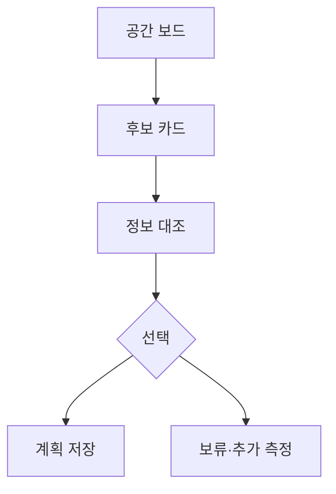

# VC-29 건우 사이트구조맵 B안 V3 — 공간 계획 보드형

## 1. Client·REQ 추적
- Client: VC-29 건우, REQ-029.
- 수용 조건: 필요한 공간 정보의 확인·미확인을 구분해 후보를 보류하거나 선택한다.
- 연결 제품: PROD-025 — 보관 단위 인덱스 박스 / PROD-056 — 기록물 보관 라벨 세트 / PROD-064 — 휴대·보관 균형 노트 / PROD-096 — 공간별 보관 계획표.

## 2. 구조 전략
- 공간별 보드에 가로·세로·깊이·접근성·측정일을 기록한다.
- 입력되지 않은 값은 미확인으로 표시하고 후보를 자동 추천하지 않는다.

## 3. 페이지·콘텐츠·기능 계약
- PAGE-007 측정 보드, PAGE-008 후보 카드, PAGE-020 라벨·보관, PAGE-021 비교.
- 후보마다 확인된 정보, 미확인 정보, 사용자 확인 행동을 노출한다.

## 4. 사용자 흐름·상태
- 공간 보드 → 후보 카드 → 정보 대조 → 선택/보류 → 계획 저장.
- 상태: 작성 중, 검증 필요, 적합성 미정, 보류, 저장, 오류·복귀.

## 5. 중복·끊김·가정 검증
- 휴대·보관 균형 노트는 사용성 기록이며 공간 적합성 증거가 아니다.
- 라벨 세트는 식별을 돕지만 수납량이나 절약 효과를 보증하지 않는다.

## 6. Mermaid

## 7. 판정
- HOLD / HYPOTHESIS: 공간 계획과 실제 효과를 분리해 표시한다.

