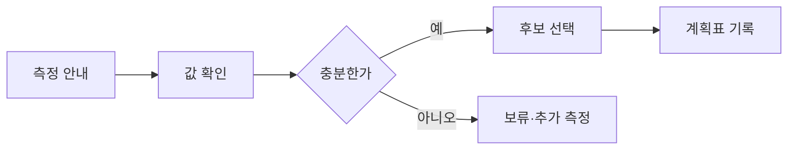

# VC-29 건우 사이트구조맵 C안 V3 — 보류 우선 안전형

## 1. Client·REQ 추적
- Client: VC-29 건우, REQ-029.
- 실패 조건: 이미지에서 크기를 추정하거나 공간 절약 효과를 단정한다.
- 연결 제품: PROD-025 — 보관 단위 인덱스 박스 / PROD-056 — 기록물 보관 라벨 세트 / PROD-064 — 휴대·보관 균형 노트 / PROD-096 — 공간별 보관 계획표.

## 2. 구조 전략
- 실측값이 부족하면 후보를 보류하고 측정 체크리스트로 되돌린다.
- 확인된 값만 비교에 사용하며 보관 효과는 사용자 검증 항목으로 남긴다.

## 3. 페이지·콘텐츠·기능 계약
- PAGE-007 측정 안내, PAGE-008 후보, PAGE-020 보관 조건, PAGE-021 비교·보류.
- 오류·오프라인에서는 읽기와 수동 입력만 허용하고 취소·복귀를 보장한다.

## 4. 사용자 흐름·상태
- 측정 안내 → 값 확인 → 후보 보류/선택 → 계획표 기록 → 재검토.
- 상태: 측정 필요, 확인, 미확인, 보류, 선택, 오류·복귀.

## 5. 중복·끊김·가정 검증
- 제품 이미지와 실제 치수를 동일 근거로 취급하지 않는다.
- 공간 절약·적합성 문구는 실측과 사용자 확인 전까지 가설로 표시한다.

## 6. Mermaid

## 7. 판정
- HOLD / HYPOTHESIS: 실측 없는 적합성·절약 효과를 차단한다.

