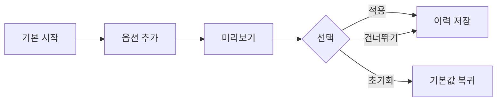

# VC-30 서진 사이트구조맵 A안 V3 — 단계적 커스터마이징형

## 1. Client·REQ 추적
- Client: VC-30 서진(커스터마이징 후회 방지), REQ-030.
- 요구: 단계적 옵션, 선택 건너뛰기, 변경·초기화 영향과 추천 수정을 이해한다.
- 연결 제품: PROD-016 — 재사용 메모 스탬프 세트 / PROD-047 — 직접 만든 라벨 보관 세트 / PROD-083 — 자산 수정 이력 카드.

## 2. 구조 전략
- 기본값으로 시작한 뒤 필요한 옵션만 단계적으로 추가한다.
- 변경 전 영향과 초기화를 설명하고 모든 옵션 선택을 강제하지 않는다.

## 3. 페이지·콘텐츠·기능 계약
- PAGE-002 시작 설정, PAGE-003 옵션 선택, PAGE-010 수정 이력, PAGE-019 재개.
- 건너뛰기, 미리보기, 변경·초기화, 원래 설정 복귀를 제공한다.

## 4. 사용자 흐름·상태
- 기본 시작 → 옵션 추가 → 미리보기 → 적용/건너뛰기 → 이력 저장.
- 상태: 기본값, 선택 중, 변경 예정, 적용, 초기화, 취소·오류.

## 5. 중복·끊김·가정 검증
- 메모 스탬프와 라벨은 선택 도구이며 수정 이력 카드가 변경 사실을 추적한다.
- 추천은 선택 사항이고 결과를 보장하지 않는다.

## 6. Mermaid

## 7. 판정
- KEEP / INFERENCE: 필수 설정 없이 시작하고 변경 가능 범위를 투명하게 설명한다.

