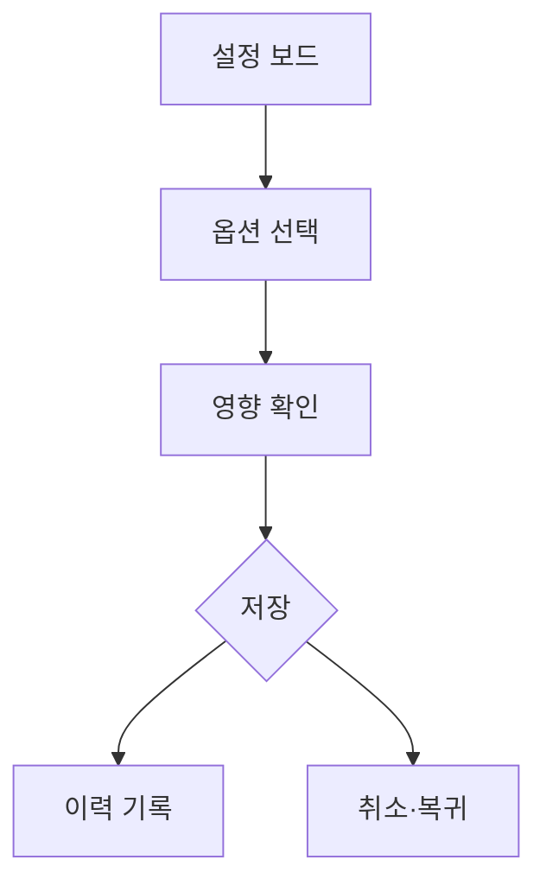

# VC-30 서진 사이트구조맵 B안 V3 — 선택 기록 보드형

## 1. Client·REQ 추적
- Client: VC-30 서진, REQ-030.
- 수용 조건: 필수 설정 없이 시작하고 나중에 바꿀 수 있는 범위를 이해한다.
- 연결 제품: PROD-016 — 재사용 메모 스탬프 세트 / PROD-047 — 직접 만든 라벨 보관 세트 / PROD-083 — 자산 수정 이력 카드.

## 2. 구조 전략
- 현재 설정, 선택 가능한 옵션, 변경 영향, 초기화 버튼을 한 보드에 배치한다.
- 미선택은 정상 상태로 남기고 추천 수정은 사용자가 명시적으로 수락한다.

## 3. 페이지·콘텐츠·기능 계약
- PAGE-002 현재 설정, PAGE-003 옵션 보드, PAGE-010 이력, PAGE-019 복귀.
- 각 변경에 전후 비교, 취소, 저장, 초기화를 계약한다.

## 4. 사용자 흐름·상태
- 설정 보드 → 옵션 선택 → 영향 확인 → 저장 또는 취소.
- 상태: 미선택, 선택됨, 영향 확인 필요, 저장됨, 취소됨, 오류.

## 5. 중복·끊김·가정 검증
- 자산 이력은 변경 시점과 내용을 기록하되 자동 추천의 근거로 과장하지 않는다.
- 라벨·스탬프 적용 범위는 사용자 선택과 실제 자산에 한정한다.

## 6. Mermaid

## 7. 판정
- KEEP / INFERENCE: 선택 기록과 변경 영향의 가시성을 우선한다.

