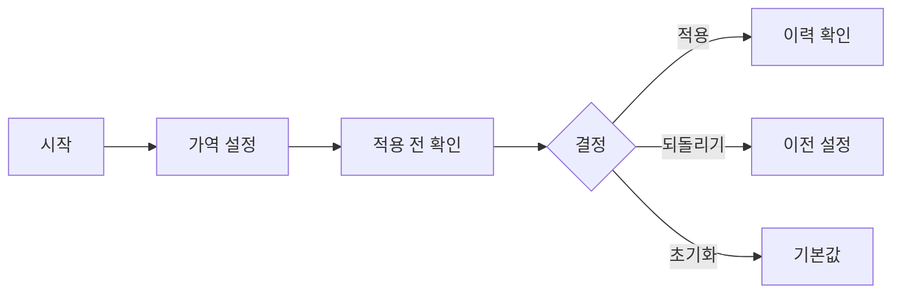

# VC-30 서진 사이트구조맵 C안 V3 — 되돌릴 수 있는 설정형

## 1. Client·REQ 추적
- Client: VC-30 서진, REQ-030.
- 실패 조건: 모든 옵션을 요구하거나 변경 가능성을 과장한다.
- 연결 제품: PROD-016 — 재사용 메모 스탬프 세트 / PROD-047 — 직접 만든 라벨 보관 세트 / PROD-083 — 자산 수정 이력 카드.

## 2. 구조 전략
- 모든 커스터마이징을 가역적 단계로 만들고 기본값과 되돌리기를 항상 노출한다.
- 변경 불가 범위는 명시하고 추천은 참고 정보로만 제공한다.

## 3. 페이지·콘텐츠·기능 계약
- PAGE-002 기본 시작, PAGE-003 설정, PAGE-010 변경 이력, PAGE-019 재개.
- 적용 전 확인, 저장, 되돌리기, 초기화, 취소·복귀를 제공한다.

## 4. 사용자 흐름·상태
- 시작 → 가역 설정 → 적용 전 확인 → 적용/되돌리기 → 이력 확인.
- 상태: 초안, 확인 필요, 적용, 되돌림, 초기화, 오류·HOLD.

## 5. 중복·끊김·가정 검증
- 설정 변경과 자산 변경을 분리 기록해 이력의 의미를 혼동하지 않는다.
- 자동 적용·필수 옵션·효과 보장은 금지한다.

## 6. Mermaid

## 7. 판정
- KEEP / INFERENCE: 후회 방지를 위해 가역성·초기화·범위 고지를 기본 계약으로 둔다.

