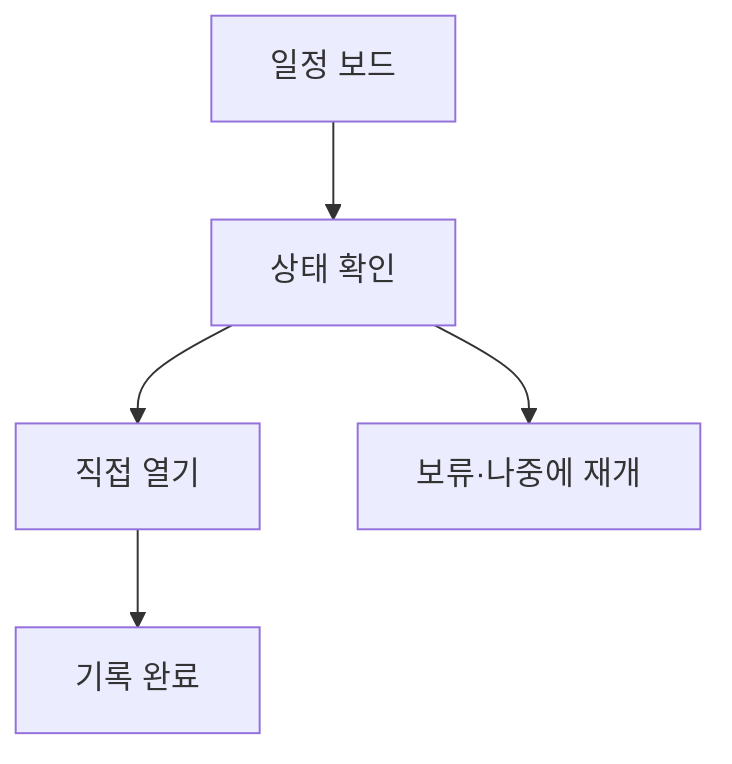

# VC-31 지민 사이트구조맵 B안 V3 — 일정 보드형

## 1. Client·REQ 추적
- Client: VC-31 지민, REQ-031.
- 수용 조건: 알림 설정 없이 기록하고 원하는 때 직접 돌아온다.
- 연결 제품: PROD-005 — 시간축 약속 카드 / PROD-035 — 선택 알림 설정 카드 / PROD-067 — 알림 없는 일정 보드.

## 2. 구조 전략
- 일정 보드에 기록 상태와 다음 행동만 표시하며 알림·streak를 분리한다.
- 알림 카드는 사용자가 선택·수정·해제한다.

## 3. 페이지·콘텐츠·기능 계약
- PAGE-012 일정 보드, PAGE-010 기록, PAGE-016 수동 재개, PAGE-020 설정.
- 비활성·일시중지·재개·복귀 상태를 명시한다.

## 4. 사용자 흐름·상태
- 일정 보드 → 상태 확인 → 직접 열기 → 기록 완료.
- 상태: 예정, 미시작, 완료, 보류, 수동 재개, 알림 꺼짐.

## 5. 중복·끊김·가정 검증
- 시간축 약속과 알림 발송을 동일시하지 않는다.
- 미완료는 경고 대신 보류와 재개 선택으로 처리한다.

## 6. Mermaid

## 7. 판정
- KEEP / INFERENCE: 수동 재개 중심으로 일정과 알림을 분리한다.

