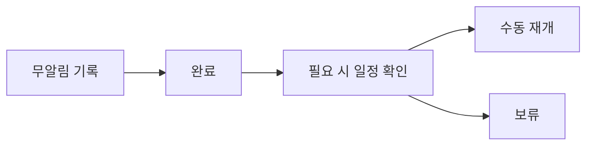

# VC-31 지민 사이트구조맵 C안 V3 — 무알림 기본형

## 1. Client·REQ 추적
- Client: VC-31 지민, REQ-031.
- 실패 조건: 놓친 기록 경고·연속 일수·죄책감 문구를 필수로 사용한다.
- 연결 제품: PROD-005 — 시간축 약속 카드 / PROD-035 — 선택 알림 설정 카드 / PROD-067 — 알림 없는 일정 보드.

## 2. 구조 전략
- 무알림을 정상 기본값으로 하고 기록과 재개를 사용자의 의지로 연결한다.
- 알림을 켜도 언제든 끄거나 일시중지할 수 있다.

## 3. 페이지·콘텐츠·기능 계약
- PAGE-010 기록, PAGE-012 일정, PAGE-016 재개, PAGE-020 알림 설정.
- 켜기·끄기·일시중지·수동 재개·취소·복귀를 계약한다.

## 4. 사용자 흐름·상태
- 무알림 기록 → 완료 → 필요 시 일정 직접 확인 → 재개.
- 상태: 무알림, 선택 알림, 중지, 완료, 재개, 오류·HOLD.

## 5. 중복·끊김·가정 검증
- 알림 없는 일정 보드는 기억 보조일 뿐 누락을 판정하지 않는다.
- 연속 일수와 죄책감 표현은 모든 상태에서 제외한다.

## 6. Mermaid

## 7. 판정
- KEEP / INFERENCE: 무알림과 자율 재개를 정상 사용자 흐름으로 유지한다.

