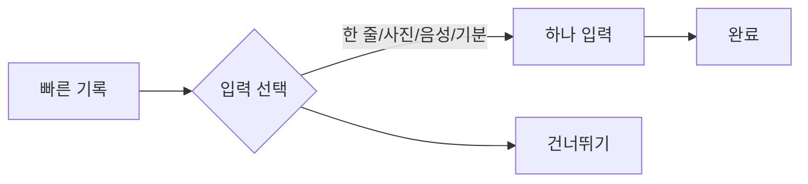

# VC-32 유진 사이트구조맵 A안 V3 — 하나만 기록형

## 1. Client·REQ 추적
- Client: VC-32 유진(빠른 기록의 의미 선택), REQ-032.
- 요구: 한 줄·사진·음성·기분 중 하나만으로 완료하고 나머지는 강제하지 않는다.
- 연결 제품: PROD-007 — 한 장 하루 회고 카드 / PROD-038 — 음성 대체 기록 카드 / PROD-069 — 한 줄 감각 회고지.

## 2. 구조 전략
- 입력 형식을 먼저 선택하고 선택한 하나만 제출하면 완료되도록 설계한다.
- 미선택 형식은 건너뛰기 상태이며 추가 입력을 요구하지 않는다.

## 3. 페이지·콘텐츠·기능 계약
- PAGE-001 진입, PAGE-010 빠른 기록.
- 한 줄·사진·음성·기분 선택, 완료 범위 안내, 취소·복귀를 제공한다.

## 4. 사용자 흐름·상태
- 빠른 기록 → 입력 형식 선택 → 하나 입력 → 완료.
- 상태: 선택 전, 입력 중, 완료, 건너뜀, 오류·재시도.

## 5. 중복·끊김·가정 검증
- 하루 회고 카드·음성 카드·감각 회고지는 서로 다른 입력 대안을 제공한다.
- 사진·문장·감정·태그를 동시에 요구하지 않는다.

## 6. Mermaid

## 7. 판정
- KEEP / INFERENCE: 하나의 입력만으로도 완료 의미를 명확히 한다.

