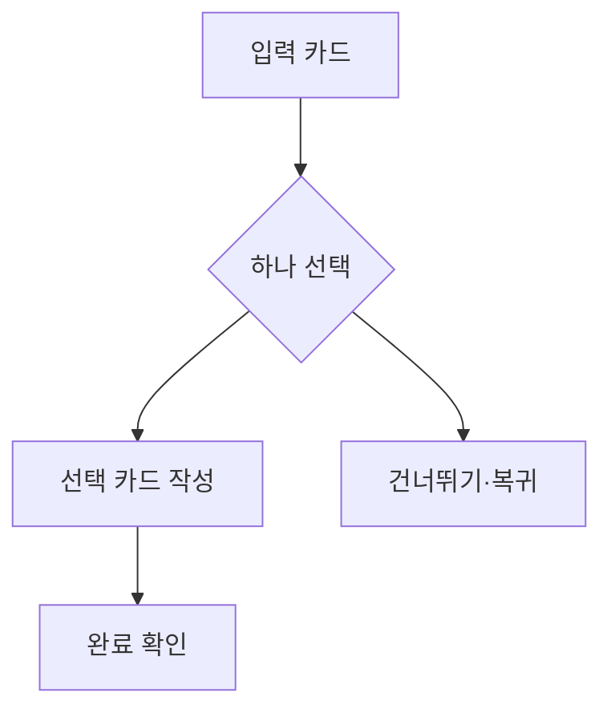

# VC-32 유진 사이트구조맵 B안 V3 — 입력 카드 비교형

## 1. Client·REQ 추적
- Client: VC-32 유진, REQ-032.
- 수용 조건: 선택한 입력 하나로 완료 상태를 이해한다.
- 연결 제품: PROD-007 — 한 장 하루 회고 카드 / PROD-038 — 음성 대체 기록 카드 / PROD-069 — 한 줄 감각 회고지.

## 2. 구조 전략
- 입력 카드 네 장을 비교하되 기본 추천이나 필수 순서를 두지 않는다.
- 선택한 카드만 활성화하고 나머지는 보류·건너뛰기로 남긴다.

## 3. 페이지·콘텐츠·기능 계약
- PAGE-001 선택 진입, PAGE-010 카드 입력.
- 각 카드에 예상 시간, 완료 기준, 취소·변경을 표시한다.

## 4. 사용자 흐름·상태
- 카드 비교 → 하나 선택 → 입력 → 완료 확인.
- 상태: 카드 선택, 작성 중, 완료, 보류, 재선택, 오류.

## 5. 중복·끊김·가정 검증
- 음성과 한 줄은 대체 경로이며 함께 작성할 필요가 없다.
- 선택하지 않은 카드가 누락이나 실패로 표시되지 않는다.

## 6. Mermaid

## 7. 판정
- KEEP / INFERENCE: 입력 대안을 동등하게 제시하고 강제를 제거한다.

