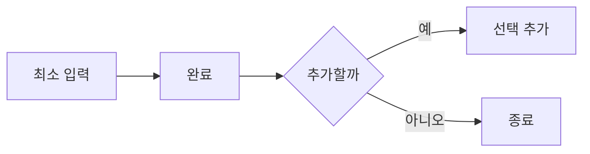

# VC-32 유진 사이트구조맵 C안 V3 — 최소 완료 안전형

## 1. Client·REQ 추적
- Client: VC-32 유진, REQ-032.
- 실패 조건: 사진·문장·감정·태그를 전부 요구한다.
- 연결 제품: PROD-007 — 한 장 하루 회고 카드 / PROD-038 — 음성 대체 기록 카드 / PROD-069 — 한 줄 감각 회고지.

## 2. 구조 전략
- 가장 부담이 낮은 한 가지 입력만으로 완료하고 추가 입력은 선택 사항으로 둔다.
- 빈 입력은 실패가 아니라 건너뛰기·보류로 처리한다.

## 3. 페이지·콘텐츠·기능 계약
- PAGE-001 빠른 시작, PAGE-010 최소 기록.
- 하나 입력, 완료 안내, 나중에 추가, 취소·복귀를 계약한다.

## 4. 사용자 흐름·상태
- 최소 입력 → 완료 → 필요 시 추가 → 종료.
- 상태: 최소 완료, 추가 선택, 보류, 재개, 오류·HOLD.

## 5. 중복·끊김·가정 검증
- 한 장 카드와 감각 회고지는 최소 기록의 예시이며 전부 작성 기준이 아니다.
- 추가 입력을 건너뛰어도 완료 상태가 유지된다.

## 6. Mermaid

## 7. 판정
- KEEP / INFERENCE: 최소 입력 완료를 정상 경로로 보장한다.

