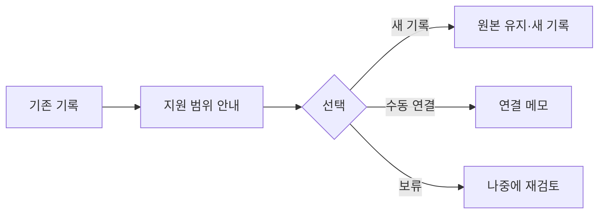

# VC-33 연우 사이트구조맵 A안 V3 — 원본 보존·새 기록형

## 1. Client·REQ 추적
- Client: VC-33 연우(기존 기록 이전 판단), REQ-033.
- 요구: 미지원 이전을 숨기지 않고 새 기록 시작과 수동 연결을 제공한다.
- 연결 제품: PROD-027 — 오래된 기록 재탐색 키트.

## 2. 구조 전략
- 이전 지원 여부를 먼저 알리고 원본은 유지한 채 새 기록 또는 보류를 선택하게 한다.
- 외부 앱 연동·완전 이전·자동 중복 제거는 확정하지 않는다.

## 3. 페이지·콘텐츠·기능 계약
- PAGE-012 기존 기록, PAGE-019 새 기록·재개, PAGE-020 이전 안내.
- 원본 보기, 수동 연결 메모, 새 기록 시작, 보류·복귀 제공.

## 4. 사용자 흐름·상태
- 기존 기록 확인 → 지원 범위 안내 → 새 기록/수동 연결/보류.
- 상태: 원본 유지, 지원 안 됨, 새 기록, 수동 연결, 보류, 오류.

## 5. 중복·끊김·가정 검증
- 재탐색 키트는 찾기 보조이며 자동 이전을 의미하지 않는다.
- 원본과 새 기록의 관계는 사용자가 직접 표시한다.

## 6. Mermaid

## 7. 판정
- HOLD / HYPOTHESIS: 실제 이전 지원 전에는 원본 보존과 수동 대안을 유지한다.

