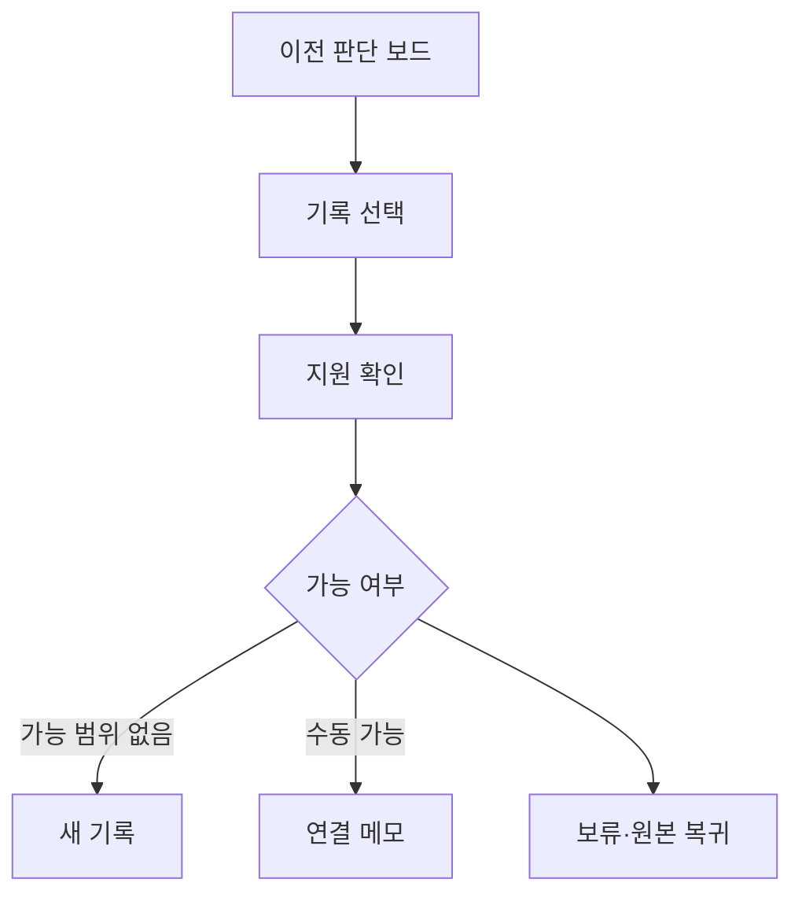

# VC-33 연우 사이트구조맵 B안 V3 — 이전 판단 보드형

## 1. Client·REQ 추적
- Client: VC-33 연우, REQ-033.
- 수용 조건: 지원 전 원본을 유지하며 새 기록만 시작하거나 보류한다.
- 연결 제품: PROD-027 — 오래된 기록 재탐색 키트.

## 2. 구조 전략
- 기존 위치·지원 형식·가능한 수동 행동을 보드로 비교한다.
- 자동 이전과 중복 제거는 미지원으로 명시한다.

## 3. 페이지·콘텐츠·기능 계약
- PAGE-012 목록과 원본, PAGE-019 새 기록, PAGE-020 범위 안내.
- 각 행에 출처, 확인일, 사용자 선택, 복귀를 표시한다.

## 4. 사용자 흐름·상태
- 판단 보드 → 기록 선택 → 지원 확인 → 새 기록/수동 연결/보류.
- 상태: 확인 중, 가능, 미지원, 수동 필요, 보류, 복귀.

## 5. 중복·끊김·가정 검증
- 수동 연결 메모는 관계 기록이지 데이터 이전이 아니다.
- 미지원 상태에서도 원본 열람과 새 기록은 가능해야 한다.

## 6. Mermaid

## 7. 판정
- HOLD / HYPOTHESIS: 지원 범위를 과장하지 않고 판단 근거를 공개한다.

