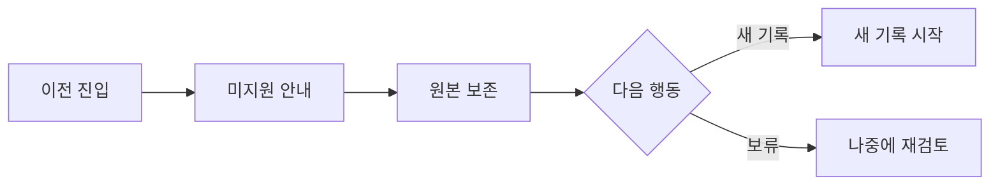

# VC-33 연우 사이트구조맵 C안 V3 — 보류 우선 안전형

## 1. Client·REQ 추적
- Client: VC-33 연우, REQ-033.
- 실패 조건: 외부 앱 연동·완전 이전·자동 중복 제거를 약속한다.
- 연결 제품: PROD-027 — 오래된 기록 재탐색 키트.

## 2. 구조 전략
- 이전 불확실성을 보류로 격리하고 원본과 새 기록의 안전한 분리를 기본값으로 둔다.
- 사용자가 확인한 경우에만 수동 연결 메모를 남긴다.

## 3. 페이지·콘텐츠·기능 계약
- PAGE-012 원본, PAGE-019 새 기록, PAGE-020 제한·보류 안내.
- 미지원 표시, 원문 보기, 새로 시작, 재시도·취소·복귀를 제공한다.

## 4. 사용자 흐름·상태
- 이전 진입 → 미지원 안내 → 원본 유지 → 새 기록 또는 보류.
- 상태: 미지원, 원본 보존, 새 기록, 보류, 오류·HOLD.

## 5. 중복·끊김·가정 검증
- 자동 중복 제거를 하지 않으며 사용자가 식별자를 직접 부여한다.
- 보류 후에도 원본 위치와 다음 행동을 보존한다.

## 6. Mermaid

## 7. 판정
- HOLD / HYPOTHESIS: 불확실한 이전은 보류하고 원본 손실을 방지한다.

