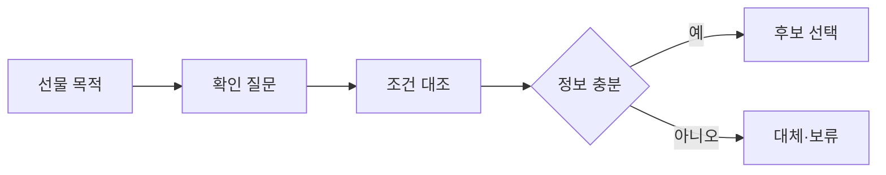

# VC-34 하윤 사이트구조맵 A안 V3 — 확인 질문형 접근성 선물

## 1. Client·REQ 추적
- Client: VC-34 하윤(선물 수령자의 접근성), REQ-034.
- 요구: 모름을 허용하고 필요한 확인 질문과 안전한 대체 후보를 제공한다.
- 연결 제품: PROD-023 — 접근성 확인 선물 패키지 / PROD-052 — 선물 확인 질문 카드 / PROD-053 — 조작 조건 비교 패키지 / PROD-091 — 대체 조작 선물 안내.

## 2. 구조 전략
- 수령자의 장애·연령·능력을 추정하지 않고 확인 가능한 조건만 묻는다.
- 정보가 없으면 추천을 보류하고 대체 후보와 확인 경로를 제시한다.

## 3. 페이지·콘텐츠·기능 계약
- PAGE-007 조건 질문, PAGE-008 후보, PAGE-014 선물 패키지, PAGE-021 비교·보류.
- 모름, 확인 필요, 대체, 원문 보기, 취소·복귀를 제공한다.

## 4. 사용자 흐름·상태
- 선물 목적 → 확인 질문 → 조건 대조 → 후보/대체 → 보류 또는 선택.
- 상태: 미확인, 확인됨, 조건 충돌, 대체 제안, 보류, 오류.

## 5. 중복·끊김·가정 검증
- 질문 카드는 정보를 수집하며 접근성 보장을 의미하지 않는다.
- 조작 조건 비교와 대체 안내는 각각 비교·대체 역할을 갖는다.

## 6. Mermaid

## 7. 판정
- HOLD / HYPOTHESIS: 확인 전 접근성 보장이나 능력 추정을 하지 않는다.

